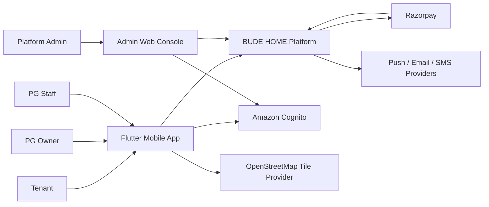
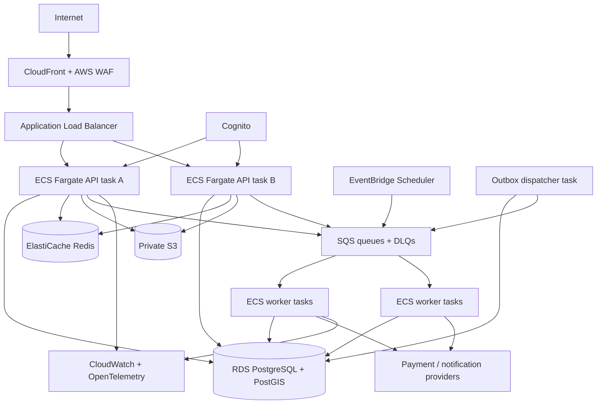
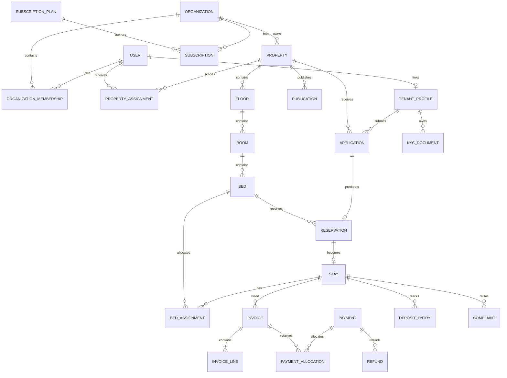
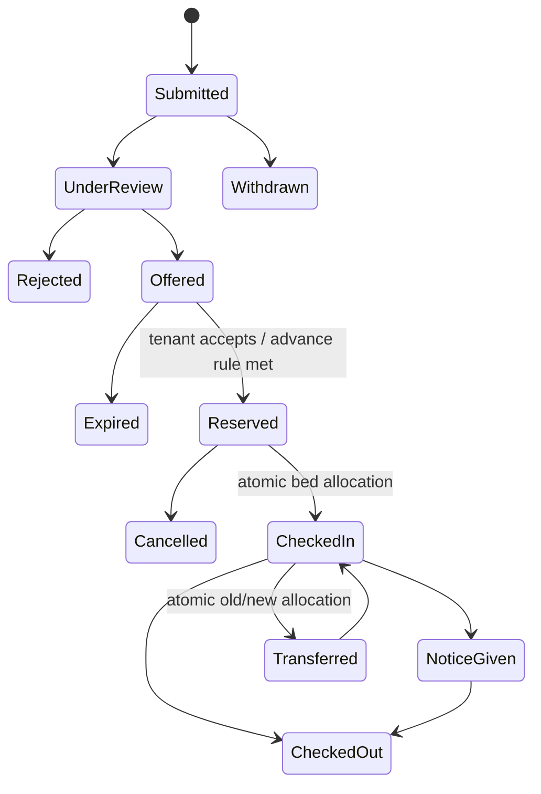
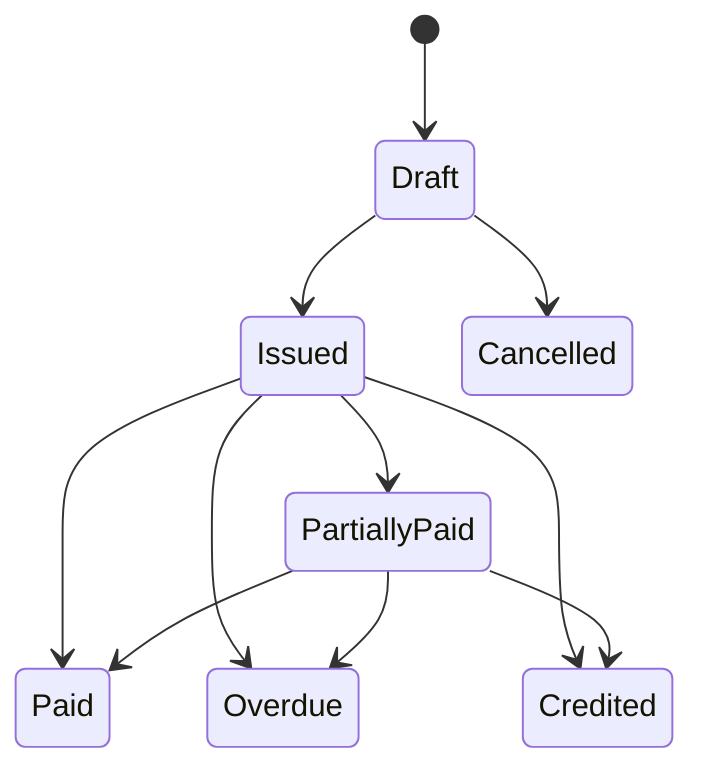
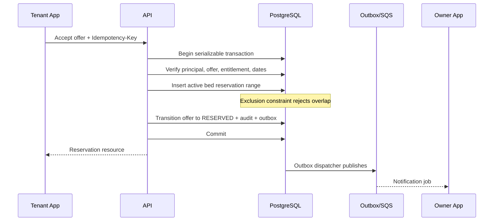

# BUDE HOME CBE — Production Implementation Plan

- **Document status:** Proposed production baseline
- **Plan version:** 1.0
- **Prepared:** 2026-09-08
- **Planning horizon:** Pilot in 20–24 weeks; production GA in 30–36 weeks with the recommended team
- **Primary region:** India (`ap-south-1`, Mumbai), subject to business and legal approval
**Source of truth:** This plan resolves and extends the three PDFs in `docs/`. Where this plan conflicts with an unsafe implementation detail in those PDFs, this plan takes precedence after stakeholder approval.

---

## 1. Outcome and guiding decisions

BUDE HOME CBE will be a mobile-first, subscription-funded, multi-tenant PG management system and public discovery marketplace. The first production architecture will be a **modular monolith**, not a distributed microservice system. The API and workers will share domain packages but run as separate stateless processes. PostgreSQL is the system of record, PostGIS supports discovery, SQS carries durable background work, and Redis is limited to cache/rate-limit uses where loss is acceptable.

### 1.1 Decisions fixed for planning

| Area | Production decision | Reason |
|---|---|---|
| Backend | TypeScript, Node.js 24 LTS, NestJS, REST/OpenAPI | One typed language across API/admin tooling; mature validation, DI, testing, and OpenAPI support. Node production workloads must remain on an LTS line. |
| Architecture | Modular monolith with API and worker deployments | Preserves transactional consistency and team velocity; module contracts and outbox events allow later extraction. |
| Database | Managed PostgreSQL 18, current supported minor, PostGIS, RDS Multi-AZ for GA | Strong consistency, exclusion constraints, RLS, geospatial search, PITR. PostgreSQL 18 is supported upstream through 2030. Confirm exact RDS/PostGIS versions in Mumbai during provisioning. |
| Data access | Prisma for generated types/basic CRUD plus reviewed SQL migrations and parameterized SQL for PostGIS, RLS, ledgers, and exclusion constraints | Prisma improves routine productivity; critical database features remain explicit and testable rather than hidden by an ORM. |
| Mobile | Flutter, one application with role-aware shells | Strong Android/iOS parity and a suitable single-app model. Android is the pilot priority; iOS follows behind the same API contracts. |
| Platform admin | Next.js TypeScript web console | Super-admin and support workflows need desktop density and must not be embedded in the consumer mobile UX. |
| Identity | Amazon Cognito User Pools using OAuth 2.0 authorization-code flow with PKCE, rotating refresh tokens, short access tokens; app DB owns memberships and authorization | Avoids building password/token primitives; authorization remains product-specific and tenant-aware. |
| Async | Transactional outbox → dispatcher → Amazon SQS; EventBridge Scheduler for timed triggers | Durable, replayable, observable work without coupling business transactions to providers. |
| Cache | ElastiCache Redis, optional in pilot and required only after measurement | Never a financial, booking, subscription, or authorization source of truth. |
| Files | Private S3 buckets, KMS encryption, quarantine/scan/promote workflow, short-lived presigned URLs | Keeps KYC and contracts private and removes file bytes from the database/API path. |
| Payments | Razorpay first behind a provider adapter; Stripe deferred | India-first UPI/payment coverage with a clean international expansion seam. |
| Infrastructure | AWS ECS Fargate, ALB, WAF, RDS, S3, SQS, EventBridge, CloudFront, Cognito, KMS, Secrets Manager, CloudWatch/OpenTelemetry; Terraform | Managed services minimize operational burden while retaining horizontal scaling. |
| CI/CD | GitHub Actions, immutable images in ECR, Terraform plan/apply gates, ECS rolling deployment with circuit breaker/rollback | Reproducible releases, auditable promotion, and automatic rollback on failed steady state. |
| Security baseline | OWASP ASVS 5.0 Level 2 target, OWASP API Security Top 10, OWASP MASVS, PCI scope minimization | Concrete verification requirements for the API and mobile application. |

### 1.2 Explicitly rejected approaches

- Do not trust `X-ORG-ID` as authorization. It is only an organization selector; the server verifies active membership and scope on every request.
- Do not store one global `users.role`. A user can have platform roles, organization memberships, property assignments, and a tenant identity independently.
- Do not use Redis locks as the primary defense against double booking. PostgreSQL constraints and transactions enforce inventory correctness.
- Do not mark invoices or payment records by overwriting history. Issued financial documents are immutable; corrections use credit notes, adjustments, allocations, and reversals.
- Do not make the mobile callback the source of payment truth. Server-verified provider responses and signed webhooks drive final state.
- Do not expose an S3 bucket or permanent KYC URLs publicly.
- Do not split modules into network services during MVP. Extraction requires measured scaling, security, ownership, or release-isolation evidence.
- Do not copy reference repositories. Reuse concepts only after license and design review.

---

## 2. Source assessment and requirement corrections

### 2.1 Authoritative inputs

| Source | Useful content | Corrections required |
|---|---|---|
| System Blueprint | Product vision, roles, modules, owner/tenant workflows, PostGIS, subscription-funded marketplace | Architecture is too high-level; no correctness, privacy, failure, or operational model; role and tenancy models are insufficient. |
| Master Data Dictionary | Initial vocabulary and entity candidates | Missing organization keys on many tables, memberships, stays, leases, reservation periods, invoice lines, payment attempts/events/allocations, deposits, audit/outbox, versions, constraints, retention, and PII classification. |
| API Specifications | Initial REST direction and sample flows | `X-ORG-ID` is unsafe if trusted; booking response skips approval; inconsistent names/statuses; no pagination, idempotency, concurrency, webhook, error, upload, versioning, or authorization contracts. |

### 2.2 Reference-project lessons

| Reference | Adopt/adapt | Do not inherit |
|---|---|---|
| `condo` | Organization/property scoping, mature SaaS operational patterns, background processing | Its scale and monorepo/service complexity are excessive for the initial team. |
| `hospitality_pms`, `pp2_hotel` | Thin controllers, authoritative domain services, explicit state transitions, single writer for room status, idempotent financial posting, property-scoped permissions | Hotel concepts such as night audit, folios, room types, and ERP coupling must not displace PG-specific monthly stays and beds. |
| `microrealestate` | Tenant portal concepts, receipts, backup/restore discipline, operational documentation | Self-hosted microservices and MongoDB are not the selected SaaS consistency model. |
| `parcelis` | Monorepo boundaries, shared schemas, explicit migrations, object keys rather than file bytes | Do not assume a reference marked pre-production is hardened. |
| `PropMS`, `utility-billing` | Recurring schedules, utility readings, deposit/lease/accounting concepts | ERPNext/Frappe dependency is not justified for this standalone product. |
| `QloApps` | Public booking presentation and availability lessons | Hotel-oriented PHP/MySQL architecture and licensing require separate review; no code reuse is planned. |
| `Hostel-Management`, `PMS` | Basic hostel vocabulary and workflow examples | Insufficient tenant isolation, security, financial controls, and production maturity. |

### 2.3 Product decisions still requiring approval

Defaults below allow engineering to proceed; owners must approve them by the end of Phase 0.

| Decision | Recommended default | Deadline |
|---|---|---|
| Payment ownership | Platform Razorpay account collects owner subscriptions; tenant rent payments use Razorpay Route/linked accounts only after legal/finance review. Until then, record offline/UPI-reference rent payments. | Before payment design freeze |
| PG contract model | Store a versioned digital stay agreement accepted by tenant and owner; no claim of statutory e-signature until counsel approves provider/process. | Before tenant pilot |
| KYC | Collect the minimum needed. Aadhaar is optional unless a lawful, reviewed use exists; mask UI, tokenize identifiers, keep files private. | Before KYC implementation |
| Taxes/invoice semantics | Subscription invoices and PG rent receipts are separate document types. Tax/GST behavior is configuration approved by accountant. | Before billing implementation |
| Gender/discovery fields | Configurable values and inclusive product review; avoid hard-coded three-value assumptions in shared schema. | Before catalog UI |
| Cancellation/refund policy | Organization-configured policy with version captured on booking; safe default is manual approval. | Before booking launch |
| Data retention | KYC: active stay + approved legal period; rejected applications: 90 days by default; audit/finance: policy from counsel/accountant. | Before production data |
| Support access | Time-bound, reason-required, MFA-protected impersonation with tenant notification option and immutable audit. | Before support console |

---

## 3. Scope and release boundaries

### 3.1 Pilot MVP — required

- Owner signup, identity verification, organization creation, trial/subscription entitlement.
- Organization membership and property-scoped staff assignments.
- Property, floor, room, bed, facilities, rules, pricing, media, and publish workflow.
- Public list/map/radius discovery for eligible properties.
- Tenant profile, application, owner approval/rejection, time-limited reservation, advance request.
- Atomic bed allocation, check-in, active stay, notice, room/bed transfer, checkout.
- Monthly fixed rent, manually entered variable charges, invoices, receipts, offline payments, Razorpay online payments where the commercial flow is approved.
- Deposit receipt, deductions, refund request, approval, and settlement tracking.
- Complaints, assignment, statuses, comments, and notifications.
- Essential owner dashboards: occupancy, dues, collections, upcoming move-ins/outs, open complaints.
- Platform console: organizations, plans, subscriptions, feature flags, operational search, audited support access.
- Audit log, observability, backup/PITR, disaster-recovery drill, incident runbooks.

### 3.2 Post-pilot / GA

- Automated metered electricity calculation and configurable food/Wi-Fi plans.
- Bulk import with dry-run and error reconciliation.
- Ratings/reviews after verified checkout and moderation.
- Visitor management and staff attendance.
- Advanced analytics warehouse/read replica.
- Stripe and non-INR expansion.
- Public web marketplace/SEO.
- WhatsApp messaging after template/vendor compliance.
- Channel integrations and accounting export/integration.

### 3.3 Non-goals for first GA

- Full double-entry accounting/ERP replacement.
- Hotel-style nightly pricing/night audit.
- Microservices, Kubernetes, multi-region active/active, or event sourcing.
- Government KYC verification without a separately approved vendor and legal basis.
- Arbitrary owner-defined code, workflow scripting, or plugin execution.
- In-app chat with real-time sockets; complaints/comments and masked contact workflows are sufficient initially.

---

## 4. Assumptions, capacity, SLOs, and budgets

### 4.1 Capacity profiles

| Metric | Pilot | Regional GA | Large multi-city trigger |
|---|---:|---:|---:|
| Organizations | 50 | 2,500 | 25,000 |
| Properties | 100 | 7,500 | 75,000 |
| Beds | 5,000 | 300,000 | 3,000,000 |
| Monthly active users | 8,000 | 250,000 | 2,500,000 |
| API average / peak RPS | 10 / 75 | 150 / 1,000 | 1,500 / 10,000 |
| Monthly invoices | 4,000 | 250,000 | 2,500,000 |
| Payment webhook peak | 10 RPS | 100 RPS | 1,000 RPS |
| Media/KYC storage | 250 GB | 15 TB | 150 TB |
| Notifications/month | 100,000 | 8,000,000 | 80,000,000 |

These are planning assumptions, not forecasts. Load models must be recalculated from actual pilot telemetry. Scale up vertically and horizontally before extracting services. Consider service extraction only when one module exceeds 30% of load/cost, needs an independent security boundary, or cannot meet its SLO within the modular deployment.

### 4.2 Service objectives

| Capability | Pilot target | GA target | Measurement |
|---|---:|---:|---|
| Authenticated API availability | 99.5% monthly | 99.9% monthly | Successful non-user-error requests at ALB/API |
| Read API p95 | < 500 ms | < 350 ms | Server duration excluding client network |
| Write API p95 | < 800 ms | < 600 ms | Server duration excluding async completion |
| Nearby search p95 | < 900 ms | < 500 ms | Fixed regional load-test dataset |
| Booking correctness | Zero overlapping confirmed/reserved stays | Same | Database invariant and reconciliation |
| Payment webhook acknowledgement p95 | < 2 seconds | < 1 second | Signed event durably stored before response |
| Invoice batch completion | By 06:00 local property time | By 03:00 | Batch metrics and missing-invoice reconciliation |
| RPO / RTO | ≤15 min / ≤4 h | ≤5 min / ≤1 h | Restore drills, not configuration claims |

### 4.3 Cost controls

- Separate monthly budgets and alerts for dev, staging, and production.
- Use Fargate autoscaling with minimum two API tasks only in production; non-production may scale to zero where supported by workflows.
- Use S3 lifecycle policies for quarantined, superseded, and retained files.
- Begin without a search cluster, Kafka, Kubernetes, or data warehouse.
- Review top AWS cost categories weekly during pilot and monthly after stabilization.

---

## 5. Target architecture

### 5.1 System context



### 5.2 Deployment containers



### 5.3 Monorepo layout

```text
apps/
  api/                    NestJS HTTP API and webhook ingress
  worker/                 SQS/outbox/scheduled-job consumers
  admin-web/              Next.js platform administration
  mobile/                 Flutter Android/iOS application
packages/
  contracts/              OpenAPI-derived DTO clients and event schemas
  domain/                 Pure domain types, policies, state machines
  database/               Prisma schema, SQL migrations, RLS policies
  modules/                Bounded application modules
  observability/          Logging, tracing, metrics, redaction
  testing/                Fixtures, builders, tenant/security test harness
  config/                 Typed configuration and environment validation
infra/
  terraform/              Account, network, data, compute, observability stacks
docs/
  adr/                    Architecture decision records
  api/                    Generated OpenAPI and integration guidance
  runbooks/               Operations and incident procedures
```

Dependency rule: `apps → modules → domain`; infrastructure adapters implement interfaces owned by modules/domain. Modules may not read another module's tables directly except through an approved read model. ESLint dependency rules and architecture tests enforce this.

### 5.4 Modules and extraction boundaries

| Module | Owns | Key invariants | Possible extraction trigger |
|---|---|---|---|
| Identity | Cognito subject mapping, sessions metadata | One internal user per provider subject; disabled user denied | Independent identity team or multiple IdPs |
| Access | organizations, memberships, roles, property assignments | Every private action derives a verified principal/scope | Central policy service needed by multiple products |
| Entitlements | plans, subscriptions, usage counters, feature grants | Limits checked transactionally; expiry never deletes data | High subscription/provider change rate |
| Catalog | properties, floors, rooms, beds, facilities, rules, media | Hierarchy belongs to one org; archived inventory not allocatable | Catalog write load becomes independent |
| Marketplace | publication projection, search | Only published, eligible, safe fields visible | Search load/SLO requires independent index |
| Booking | applications, offers, reservations | No active overlapping reservation/allocation for a bed | Very high booking concurrency |
| Residency | tenant profiles, KYC, agreements, stays, movements | One active bed assignment per stay; transitions audited | Separate compliance/security boundary |
| Billing | charge rules, invoices/lines, credit notes, deposit ledger | Issued documents immutable; totals reproducible | Dedicated finance team or ledger throughput |
| Payments | orders, attempts, provider events, allocations, refunds | Provider events idempotent; money never represented as float | PCI/provider isolation requirement |
| Operations | complaints, comments, assignments, SLA | State transitions and assignee scopes enforced | Large field-operations product |
| Notifications | templates, preferences, delivery attempts | No sensitive payload in push/SMS; idempotent sends | Notification volume dominates workload |
| Reporting | transactional read models and exports | Queries are tenant-scoped; exports expire | Warehouse/read replica becomes necessary |
| Platform | plans, feature flags, admin cases, support access | Privileged actions require MFA, reason, audit | Separate internal control plane |

---

## 6. Identity, multi-tenancy, and authorization

### 6.1 Principal model

- `users` maps an immutable Cognito `sub` to application identity; email/mobile are mutable verified attributes, not primary keys.
- `platform_role_assignments` grants rare roles such as `PLATFORM_ADMIN`, `SUPPORT`, `SECURITY_AUDITOR`.
- `organization_memberships` links user ↔ organization with `OWNER`, `MANAGER`, `ACCOUNTANT`, or `STAFF` role and lifecycle status.
- `property_assignments` narrows staff access to one or more properties and capability sets.
- `tenant_profiles` represent people who may occupy a bed; a profile may link to a user but can exist before account activation.
- `stay_participants` connects tenant profiles/users to a stay, enabling co-occupants or guardians later.

### 6.2 Request authorization flow

1. ALB/WAF accepts TLS request and attaches a request ID.
2. API validates issuer, audience, algorithm, expiry, and token use against Cognito JWKS; unknown/stale keys fail closed.
3. API maps `sub` to an enabled internal user.
4. Public endpoints enter an explicitly public policy path and query only the marketplace projection.
5. Private tenant routes resolve organization from the resource or optional `X-Organization-ID` selector.
6. Access module verifies active membership/property assignment and calculates capabilities.
7. Controller invokes a use case with an immutable `RequestPrincipal`; no controller-supplied `org_id` is passed as authority.
8. Database transaction executes `SET LOCAL app.user_id`, `app.org_id`, and `app.is_platform_admin=false`; RLS denies cross-org rows.
9. Application policy verifies action and resource scope. Both app policy and RLS must pass.
10. Sensitive/privileged actions require recent MFA/step-up and produce an audit event.

### 6.3 RLS rules

- Every organization-owned table has a non-null `organization_id` included in relevant unique/FK constraints.
- API/worker database roles cannot disable or bypass RLS and do not own tables.
- `FORCE ROW LEVEL SECURITY` is enabled on organization-owned tables.
- Queries run in explicit transactions so `SET LOCAL` cannot leak through the pool.
- Worker messages carry an internal organization identifier plus signed/validated schema; worker rehydrates a system principal with the minimum named capability.
- Platform administration uses separate stored procedures/repositories, a separate database role where needed, MFA, case/reason fields, and immutable audit. It does not toggle an ordinary request into `bypassrls`.
- Migration roles are separate, not available to running containers.
- Automated two-tenant tests attempt same-ID/list/search/export/file/queue attacks for every module.

### 6.4 Permission summary

| Action | Tenant | Staff | Manager | Owner | Accountant | Platform admin |
|---|---:|---:|---:|---:|---:|---:|
| View public property | Yes | Yes | Yes | Yes | Yes | Yes |
| Manage property inventory | No | Assigned/read | Yes | Yes | Read | Support case only |
| View tenant KYC | Own masked | Capability + assigned property | Capability | Capability | No by default | Break-glass only |
| Approve booking/check-in | No | Capability | Yes | Yes | No | No |
| Add charge | No | Capability | Yes | Yes | Yes | No |
| Issue invoice | Own/read | No | Yes | Yes | Yes | No |
| Record/allocate payment | Own/pay | No | Capability | Yes | Yes | No |
| Approve deposit deduction/refund | Respond/read | No | Capability with separation | Yes | Yes | No |
| Manage complaint | Own | Assigned | Yes | Yes | Read | No |
| Manage plans/features | No | No | No | No | No | Yes + MFA |
| Support impersonation | No | No | No | No | No | Time-bound, reasoned, audited |

Detailed permissions must be stored as capability constants and tested; UI visibility is never an authorization control.

---

## 7. Core data model and invariants

### 7.1 Logical relationship model



### 7.2 Common database standards

- Primary keys: UUIDv7; human-facing numbers are separate scoped sequences and never authorization secrets.
- Time: `timestamptz` in UTC; property IANA timezone controls billing/calendar boundaries. Store local `date` where the business concept is a date.
- Money: `numeric(19,4)` plus ISO-4217 currency; round at documented line/tax/total stages. Never JavaScript/JSON floating arithmetic for persisted money.
- Audit: `created_at/by`, `updated_at/by`, `version`; financial and audit tables are append-only.
- Archive: `archived_at/by/reason`; hard deletion is a privacy workflow, not general CRUD.
- Every state transition stores actor, source, reason, prior/new state, request ID, and timestamp.
- All external provider IDs have provider-scoped unique constraints.
- Sensitive values never appear in searchable logs, events, analytics, or error messages.

### 7.3 Correctness constraints

| Invariant | Database enforcement |
|---|---|
| No overlapping reservation/allocation for a bed | `EXCLUDE USING gist (bed_id WITH =, occupancy_range WITH &&)` for active statuses using `btree_gist`; state changes occur in serializable/retryable transaction. |
| One active owner membership minimum | Deferred constraint trigger/service transaction prevents removing last owner without transferring ownership. |
| Unique room/bed labels in parent | `(organization_id, floor_id, normalized_room_number)` and `(organization_id, room_id, normalized_bed_number)` unique. |
| Tenant isolation in relationships | Composite FKs include `organization_id`; RLS forced. |
| One invoice per billing occurrence | Unique `(organization_id, stay_id, schedule_id, period_start, document_kind)` plus idempotency record. |
| Issued invoice is immutable | Database trigger denies update/delete of financial fields after issue; void/credit uses new records. |
| Provider event processed once | Unique `(provider, provider_account_id, provider_event_id)`; raw verified body hash retained per policy. |
| Payment allocation cannot exceed available amount | Locked payment and invoice rows; deferred balance checks in one transaction. |
| Subscription limits cannot race | Lock active entitlement/usage row; count/update and resource insert in one transaction. |
| Published property is eligible | Publication service transaction verifies active property, required content, availability policy, and entitled organization; async reconciliation unpublishes expired organizations. |

### 7.4 Financial model

- `charge_rules` describe recurring rent and optional service rules with effective date ranges.
- `invoice_schedules` materialize the next due occurrences; generation claims occurrences with `FOR UPDATE SKIP LOCKED`.
- `invoices` and `invoice_lines` are drafts until issue. Issued documents are snapshots and immutable.
- `credit_notes` and `adjustment_lines` correct issued invoices; no destructive editing.
- `payment_orders` request collection; `payment_attempts` record each provider attempt.
- `provider_events` store signature-validation result, event ID, raw-body digest, receipt/processing times, and outcome.
- `payments` record confirmed funds; `payment_allocations` apply them to invoices; unallocated balances remain explicit.
- `deposit_entries` form an append-only subledger: received, deduction proposed, deduction approved/rejected, refund requested, refund paid, adjustment.
- A daily reconciliation job compares internal orders/payments/refunds with provider API/settlement exports and creates exceptions; it never silently mutates discrepancies.

### 7.5 PII classes

| Class | Examples | Controls |
|---|---|---|
| Public | Published PG name, approved photos, approximate map point, facilities | Publication review; strip metadata; separate projection/bucket. |
| Internal | Staff assignments, occupancy, operational notes | Tenant scope, least privilege, encrypted transport/storage. |
| Confidential | Contact details, agreements, invoices, complaints | Masked UI, audited access, export controls, retention. |
| Restricted | KYC image/number, bank/refund data, auth/security events | Dedicated KMS key/bucket prefix, field tokenization/encryption, step-up access, no analytics/logs, break-glass audit. |

---

## 8. Domain state machines

### 8.1 Booking and stay



- `Offered` may hold a bed only for a configured short period; expiration is idempotent.
- `Reserved`/active assignment ranges cannot overlap at the database level.
- Check-in validates identity requirements, agreement version, payment/deposit policy, property scope, and bed readiness in one transaction.
- Transfer closes the prior assignment and creates the new assignment atomically; it never edits historical allocation.
- Checkout closes the stay, schedules final invoice/deposit review, and frees the bed only within the committed transaction.

### 8.2 Invoice and payment



Payment attempts progress independently: `CREATED → PENDING → AUTHORIZED → CAPTURED`, with terminal `FAILED`, `CANCELLED`, or `EXPIRED`. Out-of-order webhooks are accepted, deduplicated, and reduced using monotonic provider-state rules. Refunds use `REQUESTED → APPROVED → SUBMITTED → PAID`, with `REJECTED` and `FAILED` branches and mandatory reason/audit.

### 8.3 Subscription/publication

- Subscription: `TRIALING → ACTIVE → PAST_DUE → GRACE → EXPIRED`; `ACTIVE/GRACE → CANCEL_AT_PERIOD_END → EXPIRED`; terminal `TERMINATED` requires platform action.
- Entitlement loss makes owner mutations read-only according to policy; it does not destroy operational/financial access.
- Publication: `DRAFT → REVIEW_READY → PUBLISHED → SUSPENDED/UNPUBLISHED/ARCHIVED`.
- Marketplace visibility requires `PUBLISHED` plus current marketplace entitlement plus platform moderation status. These remain separate states.

### 8.4 Complaint

`OPEN → ACKNOWLEDGED → IN_PROGRESS → RESOLVED → CLOSED`, with `REOPENED → IN_PROGRESS`; cancellation requires actor/reason. Each transition checks property scope and records SLA timestamps.

---

## 9. API and integration contract

### 9.1 Standards

- Base path `/v1`; additive compatible changes remain within v1. Breaking changes require `/v2` and a published sunset window.
- JSON uses `camelCase`; database names remain `snake_case`.
- IDs are opaque strings. List endpoints use cursor pagination; offset pagination is restricted to small admin datasets.
- Errors use RFC 9457 Problem Details with stable `type`, `code`, `title`, `status`, `detail`, `requestId`, and field violations. No stack traces or cross-tenant hints.
- Create/financial/transition endpoints accept `Idempotency-Key`; the server stores principal, route, normalized body hash, status, and response. Reusing a key with a different body returns conflict.
- Mutable non-financial resources expose `version`/ETag; updates require `If-Match` and return 412 on stale writes.
- Every request receives `X-Request-ID`; supplied IDs are validated and replaced if unsafe.
- OpenAPI is generated in CI; generated Dart/TypeScript clients are contract-tested.
- Rate limits apply by IP, Cognito subject, organization, device/installation, and sensitive-flow key.
- Provider webhooks have dedicated paths, raw-body capture, signature validation before JSON trust, durable inbox insert, and fast 2xx response.
- Uploads use one-time logical upload intents and short presigned URLs to unique object keys. Upload completion triggers scan; only promoted objects can be read.

### 9.2 Representative endpoint catalog

| Module | Endpoints |
|---|---|
| Session/context | `GET /v1/me`, `GET /v1/me/organizations`, `POST /v1/me/active-context`, `POST /v1/me/logout` |
| Organizations | `POST /v1/organizations`, `GET/PATCH /v1/organizations/{id}`, membership invitation/accept/revoke endpoints |
| Properties | property CRUD/archive, floor/room/bed child resources, facility/rule/media resources, `POST .../publish`, `POST .../unpublish` |
| Marketplace | `GET /v1/marketplace/properties`, `GET /v1/marketplace/properties/{slug}`, `GET /v1/marketplace/search?lat=&lng=&radiusMeters=` |
| Booking | application create/read/withdraw; owner review/offer/reject; offer accept; reservation cancel/expire |
| Residency | check-in, notice, transfer, checkout, agreement acceptance, tenant profile and scoped KYC upload/review |
| Billing | charge rules; invoice preview/generate/issue/read; credit note; statement; receipt |
| Payments | payment order, client verification, webhook, allocation, refund request/approve/status |
| Operations | complaint create/read/comment/assign/transition; staff work queue |
| Subscriptions | plans, checkout, current entitlement, usage, cancel/renew; provider webhook |
| Reporting | occupancy, dues, collections, move-in/out, complaints; export create/status/download |
| Platform | organization/subscription search, moderation, feature flags, support cases/access sessions, audit search |

### 9.3 Critical booking sequence



### 9.4 Critical payment sequence

```mermaid
sequenceDiagram
    participant M as Mobile
    participant API as API
    participant RP as Razorpay
    participant DB as PostgreSQL
    participant W as Webhook ingress/worker
    M->>API: Create payment order + Idempotency-Key
    API->>DB: Validate invoice and create internal order
    API->>RP: Create provider order
    API->>DB: Save provider ID/status
    API-->>M: Checkout parameters
    M->>RP: Complete hosted/native checkout
    RP-->>M: Client result
    M->>API: Submit result for server verification
    RP->>W: Signed webhook (may duplicate/reorder)
    W->>DB: Verify raw-body HMAC; insert unique provider event
    W-->>RP: 2xx after durable receipt
    W->>DB: Lock order; monotonic transition; create payment/allocation/outbox
    API-->>M: Poll/push authoritative payment state
```

Razorpay documents at-least-once, potentially out-of-order webhook delivery. Deduplicate on `x-razorpay-event-id`, verify HMAC-SHA256 over the unmodified raw request body, preserve old webhook secrets during a rotation window, and never depend on client success alone.

---

## 10. Security, privacy, and abuse controls

### 10.1 Verification baseline

- API/admin: OWASP ASVS 5.0 Level 2 requirements tracked in a versioned security checklist.
- API threat coverage: OWASP API Security Top 10 2023, especially object/property/function authorization and sensitive business-flow abuse.
- Mobile: OWASP MASVS storage, cryptography, authentication, network, platform, code, resilience, and privacy controls; use MASTG tests for release evidence.
- Payments: keep card data entirely within provider SDK/hosted surfaces; store provider tokens/IDs only. Validate PCI scope with the provider/acquirer.
- Privacy: map data lifecycle to India DPDP Act 2023 and notified DPDP Rules 2025 rollout. Counsel must validate notices, consent/legitimate uses, processors, rights, breach process, retention, children/guardian cases, and effective dates.

### 10.2 Threat/control matrix

| Threat | Preventive controls | Detection/recovery |
|---|---|---|
| Cross-tenant BOLA/BFLA | Membership-derived context, policy checks, composite FKs, forced RLS, deny-by-default DTOs | Two-principal security tests; audit anomaly alert; incident runbook |
| Privilege/Super Admin abuse | MFA/step-up, separate platform roles, time-limited support case, least privilege, no shared admin | Immutable reasoned audit; alert on KYC/bulk exports/support access |
| Credential/OTP attacks | Cognito threat controls, throttles, generic responses, CAPTCHA/risk challenge when triggered | Failed-login/OTP dashboards, IP/device velocity alerts |
| Token theft/replay | PKCE, 5–10 minute access tokens, refresh rotation/revocation, secure mobile keystore, logout revocation | `jti`/session telemetry; revoke sessions/user; force reauth |
| Booking race/abuse | Exclusion constraints, idempotency keys, transaction retry, per-user/property velocity limits | Conflict metrics, reservation reconciliation, abuse flags |
| Webhook forgery/replay | TLS, raw-body signature validation, event unique key, timestamp/provider checks, secret rotation | Invalid-signature alerts, inbox replay tooling, reconciliation |
| Financial corruption | Immutable issued documents, append-only allocations/ledger, separation of duties, DB constraints | Daily provider/bank reconciliation, exception queue, audit |
| Malicious uploads | MIME/signature/size/dimension rules, random keys, quarantine, malware scan, image re-encode, metadata strip | Scan failures quarantined; object-access audit and purge tooling |
| KYC leakage | Data minimization, private S3/KMS, tokenized number, masked DTOs, short read URLs, restricted capabilities | Access audit/alerts, key revocation, breach workflow |
| Injection/mass assignment | Allowlisted DTOs, strict validation, parameterized SQL, output encoding, no arbitrary query fields | SAST/DAST/WAF signals, security logs |
| SSRF | No arbitrary URL fetch; allowlisted providers; egress controls; DNS/IP validation where fetch is unavoidable | Denied egress metrics and alerts |
| Resource exhaustion | Body/upload/query limits, pagination caps, timeouts, WAF and multi-key rate limits, job quotas | Saturation dashboards, autoscaling, circuit breakers |
| Supply-chain compromise | Lockfiles, signed/provenance-aware builds, Dependabot/Renovate, SCA, SBOM, pinned actions/images | Critical-CVE release gate, image rollback and rotation |
| Secret leakage | Secrets Manager/KMS, no plaintext secrets or `.env` in images, short-lived CI OIDC credentials | Secret scanning, CloudTrail alerts, documented rotation |
| Backup/log leakage | KMS encryption, isolated backup permissions, log redaction/schema allowlists | Restore/access drills, Macie-style scans if justified, audit |

### 10.3 Mobile controls

- Store refresh tokens only in Android Keystore/iOS Keychain-backed secure storage; never in shared preferences/plain database.
- Prevent sensitive KYC/payment screens from app-switcher snapshots and screenshots where platform support permits.
- Redact notification bodies; use “Action required” rather than invoice/KYC/complaint details on lock screens.
- Validate universal/app links and allowlist routes; no tokens in deep-link query strings.
- Production build disables debugging, verbose logs, test endpoints, cleartext traffic, and local backups of restricted data.
- Use platform TLS validation. Certificate pinning is introduced only with a tested rotation/recovery strategy.
- Root/jailbreak/device-attestation signals are risk inputs, not an automatic denial that locks legitimate users out.
- Support a minimum app version and forced security upgrades with a server-controlled grace window.

### 10.4 Retention/deletion workflow

1. Data inventory assigns purpose, legal basis, owner, processors, class, and retention.
2. User request enters an authenticated privacy case; identity and scope are verified.
3. Legal/financial holds are evaluated and documented.
4. Data is exported, corrected, de-linked, anonymized, or deleted per table policy.
5. Search/read models, objects, caches, and queued work are included.
6. Backups age out under documented schedules; they are not selectively edited, and restored data re-enters deletion processing.
7. Completion evidence contains no restricted data.

---

## 11. Reliability, observability, and operations

### 11.1 Failure design

- Provider calls use short connect/read timeouts, bounded exponential backoff with jitter, and circuit breakers. Do not retry validation/business failures.
- SQS consumers are idempotent. After bounded retries, messages enter a DLQ with alarm and controlled replay tool.
- Outbox rows and webhook inbox rows expose lag/age metrics. A reconciliation job catches events that queues/providers miss.
- API readiness checks database connectivity without mutating state; liveness does not fail solely because a downstream provider is unavailable.
- Deploy expand/contract database migrations: add compatible schema, deploy dual-read/write if required, backfill resumably, switch, then remove later.
- ECS deployment circuit breaker automatically rolls back tasks that cannot reach steady state.
- RDS automated backups/PITR and encrypted cross-account backup copies are configured. Restore drills must prove RPO/RTO quarterly.

### 11.2 Telemetry

- Structured JSON logs with `timestamp`, `level`, `service`, `version`, `environment`, `requestId`, `traceId`, `routeTemplate`, `principalType`, hashed user/org correlation, outcome, duration, and stable error code.
- Never log tokens, authorization headers, cookies, raw KYC, payment payloads, phone/email, presigned URLs, or request bodies by default.
- OpenTelemetry traces cover HTTP, SQL, SQS, object storage, and provider adapters; sampling preserves errors/high latency.
- RED metrics for services, USE metrics for infrastructure, and business invariants for booking/payment/invoice flows.
- Dashboards: API health, DB/pool, queues/DLQs, outbox/inbox lag, Cognito auth, marketplace, booking conflicts, invoices, payment reconciliation, notifications, storage/security, deployment.

### 11.3 Required alerts and runbooks

| Alert | Trigger | Runbook |
|---|---|---|
| API burn rate | Multi-window SLO error-budget burn | Triage release/dependency/DB; rollback or shed noncritical load |
| DB saturation | Connections/CPU/storage/replica lag threshold | Pool check, slow-query capture, scale/failover |
| Oldest queue/outbox age | Exceeds per-queue SLO | Stop poison source, scale worker, DLQ/replay |
| Payment mismatch | Reconciliation exception or webhook signature spike | Freeze automation for affected order, provider verify, audited correction |
| Missing invoices | Expected occurrence without issued/draft result | Rerun idempotent batch; inspect schedule/timezone |
| Suspected tenant leak | Cross-org denial anomaly or report | Revoke access, preserve evidence, assess scope, incident/privacy process |
| Admin compromise | Risk signal or unexpected support access/export | Disable principal, revoke sessions, rotate affected secrets, audit actions |
| Backup/restore failure | Backup job or quarterly drill fails | Repair backup path and repeat restore; launch continuity decision if incident |

Runbooks required before pilot: deployment rollback, database failover/restore, provider outage, duplicate/out-of-order webhook, invoice batch recovery, DLQ replay, secret/key rotation, compromised account, data leak, malicious upload, notification outage, bad migration, and regional outage.

---

## 12. Environments, CI/CD, and release governance

### 12.1 Accounts/environments

- Separate AWS accounts for production and non-production; centralized audit/log archive account when the organization is ready.
- Local: Docker Compose with PostgreSQL/PostGIS, a local S3-compatible store, queue emulator only where contract behavior is adequate, and fake providers.
- CI: ephemeral database per job with all migrations/RLS enabled.
- Development: shared integration environment with synthetic data only.
- Staging: production-like topology and provider test modes; no copied production PII.
- Production: Mumbai Multi-AZ, minimum two API tasks across AZs, restricted operator access.

### 12.2 Pull-request pipeline

1. Secret scan and license policy.
2. Format/lint and architecture dependency checks.
3. Type checks and generated-contract drift check.
4. Unit/domain/property-based tests.
5. Migration apply from empty DB and upgrade from previous schema.
6. Integration, RLS, cross-tenant, idempotency, and concurrency tests.
7. Build signed immutable containers/mobile artifacts; create SBOM.
8. SCA, SAST, IaC and container scans; block known exploitable critical/high findings according to SLA policy.
9. Deploy ephemeral/test environment; OpenAPI contract and smoke tests.
10. DAST/API authorization suite on protected test environment.

### 12.3 Promotion

- Merge produces an immutable image tagged by commit SHA, never `latest` for deployment.
- Automatic development deployment; approval-gated staging and production promotion of the same digest.
- Production requires green release gates, reviewed migration plan, rollback/roll-forward path, change record, and on-call coverage.
- Use canary/percentage or small rolling deployment; circuit breaker rollback on health regression.
- Database migrations run as a one-off least-privilege task before compatible application rollout.
- Feature flags separate deployment from release; every temporary flag has owner and removal date.
- Mobile rollout begins with internal track, closed pilot, staged percentage, crash/ANR monitoring, then general release.

---

## 13. Test strategy and release gates

| Layer | Required evidence |
|---|---|
| Domain unit | State transition and monetary calculation branches; deterministic clocks/IDs; ≥90% branch coverage for financial/auth policy modules, risk-based elsewhere |
| Database | Migrations, constraints, RLS, triggers, PostGIS queries, rollback/forward compatibility |
| Integration | Real PostgreSQL/PostGIS and provider contract fakes; outbox/inbox/SQS behavior |
| Authorization | Every endpoint with no token, wrong org, wrong property, wrong role, wrong owner, disabled membership, platform role, and support session |
| Concurrency | 50+ simultaneous claims for one bed yields one success; duplicated invoice/payment/refund commands yield one effect |
| Contract | OpenAPI schema validation, generated-client compile, backward-compatibility diff |
| End-to-end | Owner onboarding → publish; tenant discovery → booking → stay → billing → payment → checkout; complaint lifecycle |
| Security | ASVS L2 checklist, API Top 10 suite, MASVS/MASTG mobile checks, SAST/SCA/DAST, annual independent penetration test before broad GA |
| Performance | Baseline and 2× projected peak, 60-minute soak, invoice batch, geospatial query plan, queue recovery |
| Resilience | Provider timeouts, DB failover, duplicate/reordered messages, worker crash after side effect, storage failure |
| Recovery | Quarterly encrypted backup restore into isolated account; measure RPO/RTO and validate representative objects/rows |

No production release may proceed with failed tenant-isolation tests, unreviewed destructive migration, unreconciled financial invariants, critical known vulnerability, missing rollback path, or failed backup restore evidence.

---

## 14. Delivery model, team, and sequencing

### 14.1 Recommended team

- 1 product owner/domain analyst (full-time through pilot).
- 1 tech lead/backend architect.
- 2 backend engineers.
- 2 Flutter engineers.
- 1 frontend/full-stack engineer for platform console.
- 1 QA automation engineer.
- 0.5 platform/SRE and 0.5 security/privacy specialist, increasing near launch.
- Part-time UX, finance/accounting advisor, and Indian privacy/legal counsel.

With fewer than five full-time engineers, preserve phase order and reduce parallelism; do not remove security, migration, or financial-integrity work. Estimates below are team-weeks, not elapsed calendar weeks, and require re-estimation after Phase 0.

### 14.2 Milestones

| Milestone | Target | Exit outcome |
|---|---:|---|
| M0 Plan/design freeze | Week 2 | Approved flows, ADRs, threats, retention/payment decisions |
| M1 Secure foundation | Week 6 | CI/CD, environments, auth, tenancy, RLS, audit skeleton |
| M2 Owner inventory alpha | Week 11 | Owner can subscribe/configure and publish a complete PG |
| M3 Tenant booking alpha | Week 16 | Discovery through atomic reservation/check-in works |
| M4 Billing/payment beta | Week 20 | Invoices, deposits, payments, webhooks, reconciliation work |
| M5 Controlled pilot | Week 24 | 3–5 PGs, production telemetry/runbooks/support readiness |
| M6 Production GA | Week 30–36 | Hardening, independent security review, DR proof, staged launch |

### 14.3 Dependency order

`Phase 0 → Foundation/Infrastructure → Identity/Tenancy → Catalog/Entitlements → Marketplace → Booking/Residency → Billing/Payments → Operations/Reporting → Hardening/Pilot/GA`.

Mobile vertical slices proceed beside backend phases once contracts stabilize. Notifications and audit are cross-cutting, introduced in the foundation and expanded with each module.

---

## 15. Executable work breakdown: epics, tasks, and micro-tasks

### How to use this backlog

- Each `P#-T#` entry is an issue-sized task. Indented checkboxes are independently verifiable micro-tasks/subtasks.
- `Depends` names blocking tasks only. Teams may parallelize non-blocking work.
- Estimates are ideal engineer-days and include code review/unit tests, but not external approval delay.
- Every task must satisfy the global Definition of Done plus its acceptance gate.
- Product changes require updating the requirement/ADR, API contract, threat assessment, tests, and runbook where applicable.

### Global Definition of Ready

- Business actor, expected outcome, rejection/error behavior, and authorization scope are written.
- Data classification and retention impact are known.
- API/event/database changes are reviewed with owning modules.
- Acceptance examples include a happy path, forbidden cross-tenant path, duplicate/retry path, and relevant concurrency path.
- UX copy and accessibility behavior are available for user-facing work.

### Global Definition of Done

- Code, migration, tests, metrics, structured audit events, and documentation are merged.
- DTOs expose allowlisted fields only; logs and telemetry pass redaction tests.
- Tenant/role/property authorization tests pass for new endpoints and jobs.
- API contract and generated clients have no unexplained drift.
- Database changes pass empty-build and previous-version upgrade tests.
- Failure, retry, timeout, and idempotency behavior is verified.
- Dashboards/alerts/runbooks are updated for operationally material behavior.
- Product acceptance is recorded and no critical/high unaccepted security finding remains.

### Phase 0 — Product, legal, and architecture closure (M0, 18–25 team-days)

#### P0-T1 — Build traceable product requirements (PO, architect; 3 days; depends: none)

- [ ] Convert every Blueprint feature and API/data-dictionary item into a requirement ID (`AUTH`, `ORG`, `CAT`, `MKT`, `BKG`, `STAY`, `BILL`, `PAY`, `OPS`, `RPT`, `PLT`).
- [ ] Label each requirement MVP, GA, deferred, rejected, or needs decision.
- [ ] Define actor, preconditions, success state, failure state, and data class.
- [ ] Map each requirement to a planned phase/task and acceptance test.
- [ ] Record document contradictions rather than silently selecting one.
- [ ] Review the matrix with product, operations, finance, and engineering.

**Acceptance gate:** No MVP requirement is unmapped; every contradiction has an owner, deadline, and recommended default.

#### P0-T2 — Validate owner and tenant operating workflows (PO, UX, PG operator; 4 days; depends: P0-T1)

- [ ] Workshop one-property owner onboarding and one multi-property owner onboarding.
- [ ] Walk application, offer, reservation, check-in, monthly stay, notice, transfer, and checkout.
- [ ] Define no-show, cancellation, overstay, failed payment, partial payment, and abandoned KYC behavior.
- [ ] Define staff capabilities and property assignment rules.
- [ ] Define property/bed unavailable, maintenance, archive, and emergency closure behavior.
- [ ] Write scenario examples using realistic Coimbatore PG data without real PII.

**Acceptance gate:** State diagrams and exception scenarios are signed off by at least one real PG operator and product owner.

#### P0-T3 — Close finance/payment/tax decisions (PO, finance, counsel, architect; 5 days; depends: P0-T1)

- [ ] Decide whether the platform collects tenant rent or owners collect directly.
- [ ] Obtain Razorpay product/account approval for subscriptions and, if applicable, marketplace/linked-account rent flows.
- [ ] Define who issues each invoice/receipt and whose tax identity appears.
- [ ] Define security-deposit custody, deductions, dispute, approval, and refund rules.
- [ ] Define offline cash/bank/UPI evidence and approval/reversal rules.
- [ ] Document GST/TDS and invoice numbering requirements with qualified accountant review.
- [ ] Define reconciliation inputs, owner settlement visibility, and dispute escalation.

**Acceptance gate:** An approved money-flow diagram names merchant of record, fund holder, document issuer, and reconciliation owner for every payment type.

#### P0-T4 — Privacy/KYC/legal readiness assessment (privacy lead/counsel; 4 days; depends: P0-T1)

- [ ] Inventory personal data, processing purposes, recipients/processors, retention, and deletion behavior.
- [ ] Confirm DPDP Act/Rules effective-date obligations applicable at planned launch.
- [ ] Review Aadhaar/passport/driving-licence collection and eliminate unsupported mandatory fields.
- [ ] Define privacy notice, consent/withdrawal, correction, erasure, grievance, breach, and nominee/guardian flows.
- [ ] Define children/minors policy; block unsupported minor onboarding until approved.
- [ ] Review AWS, Cognito, Razorpay, messaging, analytics, maps, and crash-reporting processor terms/data locations.
- [ ] Establish breach and government/law-enforcement request procedures.

**Acceptance gate:** Counsel-approved launch checklist exists; engineering has a field-level retention/data-classification matrix.

#### P0-T5 — Write and approve ADRs (architect, leads; 3 days; depends: P0-T2, P0-T3, P0-T4)

- [ ] ADR-001 modular monolith and extraction triggers.
- [ ] ADR-002 NestJS/Node 24 LTS and upgrade policy.
- [ ] ADR-003 Flutter plus Next.js admin.
- [ ] ADR-004 PostgreSQL/PostGIS, Prisma plus explicit SQL.
- [ ] ADR-005 Cognito identity/application-owned authorization.
- [ ] ADR-006 AWS ECS/RDS/SQS/S3 deployment.
- [ ] ADR-007 tenant isolation/RLS and privileged access.
- [ ] ADR-008 financial documents/payment integration.
- [ ] ADR-009 asynchronous outbox/inbox model.
- [ ] ADR-010 API versioning/idempotency/concurrency.

**Acceptance gate:** ADRs include alternatives, consequences, reversal cost, and review trigger and are approved by the tech lead and security reviewer.

#### P0-T6 — Threat model and abuse-case workshop (security, architect, QA; 3 days; depends: P0-T2)

- [ ] Diagram trust boundaries and sensitive data stores.
- [ ] Enumerate threats for each public/mobile/admin/provider boundary.
- [ ] Model cross-tenant, admin abuse, booking hoarding, OTP abuse, payment fraud, upload abuse, and scraping.
- [ ] Rate likelihood/impact; assign prevention, detection, response, test, and owner.
- [ ] Convert high risks into backlog tasks and release gates.
- [ ] Schedule threat-model refresh at M2, M4, and pre-GA.

**Acceptance gate:** No critical/high threat lacks a funded mitigation and verification task.

### Phase 1 — Repository and engineering foundation (M1 part A, 25–35 team-days)

#### P1-T1 — Scaffold governed monorepo (tech lead; 3 days; depends: P0-T5)

- [ ] Create `apps` and `packages` layout from §5.3 without modifying `ref/` projects.
- [ ] Pin Node 24 LTS, package manager, Flutter SDK, Java/Android, and Terraform versions.
- [ ] Configure TypeScript strict mode and shared compiler/lint/format rules.
- [ ] Add module-boundary lint rules and architecture test skeleton.
- [ ] Add CODEOWNERS for access, billing, payments, database, infrastructure, and security-sensitive paths.
- [ ] Add conventional change/release policy and pull-request template with security/data/migration prompts.
- [ ] Document one-command local bootstrap and verification.

**Acceptance gate:** A fresh workstation/CI runner installs, builds, lints, and runs the empty test suites with pinned tools.

#### P1-T2 — Establish configuration and secret safety (backend, platform; 3 days; depends: P1-T1)

- [ ] Define a typed configuration schema for every runtime with startup validation.
- [ ] Separate public build-time configuration from runtime secrets.
- [ ] Add local `.env.example` containing placeholders only and verify `.gitignore` behavior.
- [ ] Integrate Secrets Manager references for deployed tasks.
- [ ] Add secret scanning locally and in CI, including commit history on protected branches.
- [ ] Redact config values from startup errors and support bundles.
- [ ] Write rotation ownership and expiry metadata convention.

**Acceptance gate:** Missing/invalid config fails before readiness; no deployed secret is present in source, image layers, Terraform state output, or logs.

#### P1-T3 — Define API platform baseline (backend; 5 days; depends: P1-T1)

- [ ] Create NestJS bootstrap with secure production defaults and graceful shutdown.
- [ ] Implement request ID validation/generation and OpenTelemetry context propagation.
- [ ] Implement Problem Details error mapper and stable error-code registry.
- [ ] Configure strict DTO validation, unknown-field rejection, body/URL/header limits, and safe serialization.
- [ ] Generate OpenAPI and fail CI on uncommitted contract changes.
- [ ] Add health, readiness, and version endpoints with minimal information.
- [ ] Add idempotency/ETag interfaces and no-op reference endpoint for harness tests.

**Acceptance gate:** Contract, validation, error, shutdown, telemetry, and header security tests pass; no exception/stack leaks in production mode.

#### P1-T4 — Build database migration baseline (database/backend; 5 days; depends: P1-T1)

- [ ] Provision local PostgreSQL/PostGIS and CI service with production extensions.
- [ ] Create separate owner/migration/API/worker/read-only roles and privilege scripts.
- [ ] Add UUID, timestamps, money, normalized-text, version, and audit conventions.
- [ ] Create migration runner with advisory lock and one-run semantics.
- [ ] Test migrate-from-empty and upgrade-from-previous in CI.
- [ ] Create rollback/roll-forward template; forbid destructive changes without expand/contract plan.
- [ ] Add query timeout and connection-pool defaults per workload.

**Acceptance gate:** Runtime roles cannot create/alter tables, bypass RLS, or use migration credentials; migrations are reproducible in CI.

#### P1-T5 — Create test harnesses and fixtures (QA/backend; 5 days; depends: P1-T3, P1-T4)

- [ ] Add deterministic ID/clock/provider ports and test implementations.
- [ ] Add factories for two organizations, multiple properties/roles, tenant identities, and disabled memberships.
- [ ] Build authenticated API client helpers for each principal type.
- [ ] Build cross-tenant matrix helper applied to endpoint tests.
- [ ] Add concurrency runner and invariant query helpers.
- [ ] Add fake S3/SQS/payment/notification adapters with failure injection.
- [ ] Ensure fixtures contain synthetic, obviously fake PII.

**Acceptance gate:** Reference tests prove the harness catches an intentionally cross-tenant query, duplicate effect, stale update, and provider timeout.

#### P1-T6 — Establish generated contracts and client workflow (backend/mobile/web; 4 days; depends: P1-T3)

- [ ] Select OpenAPI generators and pin templates/tool versions.
- [ ] Generate Dart and TypeScript clients into controlled packages.
- [ ] Add CI compatibility diff and client compilation.
- [ ] Define nullable/optional/date/money/error serialization rules.
- [ ] Add mock server from OpenAPI for parallel UI development.
- [ ] Publish internal contract changelog and deprecation policy.

**Acceptance gate:** Mobile/admin example apps compile against generated clients; a breaking fixture change fails CI.

#### P1-T7 — Add audit and outbox primitives (backend/database; 5 days; depends: P1-T4)

- [ ] Create append-only `audit_events`, `outbox_events`, and `idempotency_records` schemas.
- [ ] Define versioned event envelope, actor types, correlation/causation IDs, and PII-safe metadata.
- [ ] Insert audit/outbox in the same transaction as domain changes.
- [ ] Implement outbox claim/lease/retry using `FOR UPDATE SKIP LOCKED`.
- [ ] Implement idempotency body-hash conflict and cached response behavior.
- [ ] Add retention/partitioning review thresholds without premature partitioning.
- [ ] Add lag, failure, and duplicate metrics.

**Acceptance gate:** Crash-before/after publish tests show no lost committed event and no duplicate business effect.

### Phase 2 — AWS foundation and delivery pipeline (M1 part B, 30–40 team-days)

#### P2-T1 — Create account, IAM, and Terraform foundations (platform/security; 6 days; depends: P0-T5)

- [ ] Establish production/non-production AWS accounts and billing ownership.
- [ ] Configure GitHub Actions OIDC roles; prohibit long-lived AWS CI keys.
- [ ] Create Terraform remote state with encryption, locking, versioning, and restricted access.
- [ ] Define IAM permission boundaries and human SSO roles.
- [ ] Enable CloudTrail, Config/security findings, root MFA, and account contacts.
- [ ] Add tagging, budgets, anomaly detection, and environment cost alerts.
- [ ] Review Terraform plan in CI and require production approval.

**Acceptance gate:** A compromised app task cannot modify infrastructure/state/secrets outside its role; all console/CI changes are attributable.

#### P2-T2 — Build network and ingress (platform/security; 5 days; depends: P2-T1)

- [ ] Create VPC across at least two AZs with public ALB and private app/data subnets.
- [ ] Restrict security groups by source group and required port, not broad CIDRs.
- [ ] Add VPC endpoints where cost/security justify them and document NAT egress.
- [ ] Provision ACM TLS, ALB, CloudFront, DNS, and baseline WAF managed rules.
- [ ] Configure trusted proxy/header handling and reject spoofed forwarding headers.
- [ ] Add access-log destinations and retention.
- [ ] Validate only approved public surfaces are reachable.

**Acceptance gate:** External scan sees only intended HTTPS endpoints; database/cache/tasks have no public address or direct ingress.

#### P2-T3 — Provision managed data services (platform/database; 6 days; depends: P2-T2, P1-T4)

- [ ] Confirm RDS PostgreSQL 18/PostGIS support and exact versions in Mumbai.
- [ ] Provision encrypted RDS with parameter group, deletion protection, backups/PITR, performance insights, and Multi-AZ in production.
- [ ] Configure RDS Proxy or sized application pools only after connection testing; cap total pool below safe DB limits.
- [ ] Provision Redis only when cache/rate-limit requirements are enabled; TLS/auth and no public access.
- [ ] Create private S3 quarantine, restricted, public-derived-media, exports, and log buckets with block-public-access and lifecycle policies.
- [ ] Create KMS keys/aliases and key policies separating app, security, and backup access.
- [ ] Configure encrypted backup copy and restore target.

**Acceptance gate:** Encryption, backup/PITR, restore permissions, lifecycle, deletion protection, and network isolation are verified by automated policy tests.

#### P2-T4 — Provision compute, queues, and scheduler (platform/backend; 6 days; depends: P2-T2)

- [ ] Create ECR repositories with immutable tags, scan-on-push, and lifecycle rules.
- [ ] Create ECS cluster, API service, outbox dispatcher, workers, and one-off migration task definitions.
- [ ] Use non-root/read-only containers, dropped capabilities, ephemeral writable mounts, and task-specific IAM roles.
- [ ] Create purpose-specific SQS queues and DLQs with encryption, visibility timeout, retention, and redrive controls.
- [ ] Create EventBridge schedules that enqueue commands rather than directly execute business mutations.
- [ ] Configure autoscaling on CPU/memory and queue age/depth.
- [ ] Enable deployment circuit breaker and automatic rollback.

**Acceptance gate:** Failure-injected deployment rolls back; poison messages reach DLQ; workloads have distinct least-privilege identities.

#### P2-T5 — Build CI/CD and environment promotion (platform/QA; 5 days; depends: P2-T1, P2-T4, P1-T5)

- [ ] Implement §12.2 pull-request stages with required checks.
- [ ] Build reproducible multi-stage images and attach SBOM/provenance.
- [ ] Deploy integration environment per protected workflow and run smoke/contract tests.
- [ ] Implement development auto-deploy and staging/production approvals for the same digest.
- [ ] Run migration task with compatibility gate before app rollout.
- [ ] Capture release/deployment metadata in telemetry and audit.
- [ ] Prove rollback and roll-forward in staging.

**Acceptance gate:** A tagged candidate is promoted without rebuilding; failed health/migration/security gates prevent production release.

#### P2-T6 — Establish observability and incident foundation (SRE/backend/security; 5 days; depends: P2-T4)

- [ ] Deploy structured log pipeline with schema/redaction tests and access controls.
- [ ] Export HTTP/SQL/SQS/provider traces and core metrics via OpenTelemetry.
- [ ] Create service, DB, queue, deployment, cost, and security dashboards.
- [ ] Implement multi-window availability/latency burn-rate alerts.
- [ ] Create incident severity, ownership, communication, evidence, and postmortem templates.
- [ ] Create synthetic API/marketplace checks from outside AWS.
- [ ] Exercise one deployment and one queue incident in staging.

**Acceptance gate:** On-call can identify failing version, route, dependency, queue, and tenant-safe correlation from a synthetic incident within 15 minutes.

### Phase 3 — Identity, organizations, tenancy, and access (M1, 35–45 team-days)

#### P3-T1 — Configure Cognito and session flows (backend/mobile/platform; 6 days; depends: P2-T2, P1-T3)

- [ ] Create separate Cognito app clients for mobile and admin web without client secrets in mobile.
- [ ] Configure authorization-code + PKCE, approved redirect/logout URIs, MFA policies, and verified attributes.
- [ ] Enable refresh-token rotation with a short retry grace and defined max session lifetime.
- [ ] Set access tokens to 5–10 minutes and validate issuer/audience/token-use/algorithm/JWKS.
- [ ] Implement server logout/session revocation and disabled-user denial.
- [ ] Add generic auth errors, throttling, enumeration tests, and recovery flows.
- [ ] Document Cognito incident/key/config rollback.

**Acceptance gate:** Login/refresh/rotation/logout/revocation/MFA work on real Android and admin staging; stolen/reused/invalid tokens fail closed.

#### P3-T2 — Implement organization and membership domain (backend/database; 6 days; depends: P3-T1, P1-T7)

- [ ] Migrate `users`, `organizations`, `organization_memberships`, invitations, and role assignments.
- [ ] Implement atomic first-user/organization/owner membership creation.
- [ ] Implement invitation issue, expiry, acceptance, resend throttle, and revoke.
- [ ] Prevent removal/demotion of the last owner.
- [ ] Implement membership disable/reactivate with session/cache invalidation.
- [ ] Add audit/outbox events and membership timeline.
- [ ] Add two-org/multi-role tests.

**Acceptance gate:** A user can belong to multiple organizations with independent roles; last-owner and cross-org invariant tests pass.

#### P3-T3 — Implement request principal and policy engine (backend/security; 7 days; depends: P3-T2)

- [ ] Define immutable principal, capability vocabulary, resource scope, and policy-decision result.
- [ ] Resolve optional organization selector only after membership verification.
- [ ] Add guards/decorators that require explicit capability and scope on every private endpoint.
- [ ] Add ownership checks for tenant-self resources and property assignment checks for staff.
- [ ] Deny missing/ambiguous context instead of selecting the first organization.
- [ ] Cache capability reads only with membership-version invalidation.
- [ ] Log denied decisions using non-sensitive stable reason codes.

**Acceptance gate:** Static/architecture tests fail endpoints lacking policy metadata; full wrong-org/role/property/owner matrix passes.

#### P3-T4 — Implement forced RLS and tenant-safe repositories (database/backend; 7 days; depends: P3-T2, P1-T4)

- [ ] Add non-null `organization_id`, composite keys/FKs, indexes, policies, and `FORCE ROW LEVEL SECURITY` to owned tables.
- [ ] Implement transaction wrapper that sets local user/org/system capability context.
- [ ] Make repositories require a transaction/context rather than a raw global client for owned data.
- [ ] Create separate public/platform repositories and database roles.
- [ ] Test pool reuse cannot retain prior tenant context.
- [ ] Test background jobs, exports, aggregates, and raw SQL under RLS.
- [ ] Add migration linter that flags organization-owned tables without policy/index/key.

**Acceptance gate:** Runtime credentials cannot read/write a second tenant even when application filters are intentionally omitted in a security test.

#### P3-T5 — Implement property-scoped staff access (backend/mobile; 5 days; depends: P3-T3)

- [ ] Migrate `property_assignments` and capability-set references with effective dates/status.
- [ ] Add owner/manager UI and APIs to assign/revoke property access.
- [ ] Validate assigner cannot grant capabilities they do not possess.
- [ ] Refresh authorization immediately on revoke.
- [ ] Filter staff work lists and search by assignment.
- [ ] Audit grants/revocations and alert on sensitive KYC/finance grants.

**Acceptance gate:** Staff can act only on assigned properties/capabilities; revoke prevents the next API request and queued work revalidates scope.

#### P3-T6 — Implement platform support access (admin/security; 6 days; depends: P3-T3, P2-T6)

- [ ] Create support case, approval, access session, scope, reason, expiry, and revocation records.
- [ ] Require recent MFA/step-up and two-person approval for restricted KYC/bulk export access.
- [ ] Use separate platform routes/repositories; never impersonate by editing membership.
- [ ] Display persistent support-session banner and remaining time.
- [ ] Audit every read/write/export under the support session.
- [ ] Alert organization/security contacts according to approved policy.
- [ ] Add emergency revoke-all control and quarterly access review.

**Acceptance gate:** Support cannot access tenant data without an approved, unexpired scope; every access is attributable and searchable.

### Phase 4 — Subscriptions and entitlements (M2 part A, 25–35 team-days)

#### P4-T1 — Implement versioned plan/entitlement model (backend/database/admin; 6 days; depends: P3-T4, P0-T3)

- [ ] Migrate plan versions, prices, feature grants, quantitative limits, trials, and effective dates.
- [ ] Keep subscribed plan snapshots stable when catalog plans change.
- [ ] Define entitlement evaluator with `ALLOW`, `READ_ONLY`, `DENY`, and usage metadata.
- [ ] Implement property/tenant/storage limits with locked usage counters and reconciliation.
- [ ] Add platform plan administration with maker/checker approval for price/limit changes.
- [ ] Audit plan and entitlement changes.

**Acceptance gate:** Concurrent resource creation cannot exceed a limit; existing subscriptions retain their contracted snapshot.

#### P4-T2 — Implement subscription lifecycle and trial (backend/database; 6 days; depends: P4-T1)

- [ ] Migrate subscriptions, periods, status transitions, grace, cancel-at-period-end, and history.
- [ ] Make first organization trial creation idempotent and abuse-limited.
- [ ] Implement renewal/expiry scheduled commands based on UTC instants and explicit billing timezone.
- [ ] Implement read-only behavior after grace without blocking invoice/receipt/export access.
- [ ] Emit events for lifecycle/entitlement changes.
- [ ] Reconcile derived current status from provider and local periods.

**Acceptance gate:** Clock-boundary, retry, cancellation, grace, expiry, and reactivation tests pass without deleting or corrupting tenant data.

#### P4-T3 — Integrate owner subscription checkout (payments/backend/mobile; 7 days; depends: P4-T2, P8-T1 can use an early shared adapter skeleton)

- [ ] Implement minimal Razorpay subscription/order adapter with test/live credential separation.
- [ ] Create server-side checkout order and signed client parameters.
- [ ] Verify client completion server-side but await/confirm authoritative provider state.
- [ ] Reuse webhook inbox/signature/idempotency controls from payments platform.
- [ ] Handle duplicate/out-of-order renewals, failures, cancellations, and late success.
- [ ] Add subscription receipt/invoice link according to approved tax flow.
- [ ] Add provider reconciliation and alerting.

**Acceptance gate:** Provider test-mode lifecycle, replayed webhooks, timeout, late success, failed renewal, and reconciliation exception pass end to end.

#### P4-T4 — Enforce marketplace visibility and mutation policy (backend; 4 days; depends: P4-T2, P5-T5)

- [ ] Define entitlement predicates separately from property publication/moderation states.
- [ ] Filter marketplace projection on eligibility at write and read time.
- [ ] Unpublish/inactivate projection through idempotent expiry event handling.
- [ ] Reconcile all projection eligibility daily.
- [ ] Preserve owner access to records, billing history, and exports when expired.
- [ ] Test expiry/renewal races and event delay.

**Acceptance gate:** Expired organizations disappear within the defined SLO, renewal restores only previously valid publication, and private data remains accessible per read-only policy.

### Phase 5 — Property, room, bed, and publication catalog (M2 part B, 35–45 team-days)

#### P5-T1 — Implement property/facility/rule model (backend/database; 6 days; depends: P3-T4, P4-T1)

- [ ] Migrate properties with lifecycle status, address components, IANA timezone, currency, gender/eligibility configuration, contact policy, and geolocation.
- [ ] Store map position as PostGIS `geography(Point,4326)` with GiST index and validated coordinate range.
- [ ] Migrate controlled facility catalog plus organization/property facility selections.
- [ ] Model house rules, notice/cancellation defaults, and versioned public policy snapshots.
- [ ] Implement create/read/update/archive APIs with optimistic concurrency.
- [ ] Enforce property entitlement limits in the same transaction as creation.
- [ ] Add authorization, RLS, audit/outbox, and validation tests.

**Acceptance gate:** Owner manages only their properties; invalid coordinates/timezones/currencies and stale updates fail safely; limit races cannot over-create.

#### P5-T2 — Implement floor/room/bed hierarchy (backend/database; 6 days; depends: P5-T1)

- [ ] Migrate floors, rooms, beds, normalized display identifiers, sort order, and archive state.
- [ ] Add organization-inclusive composite FKs and parent-scoped unique constraints.
- [ ] Separate physical bed lifecycle (`ACTIVE`, `MAINTENANCE`, `ARCHIVED`) from derived occupancy/availability.
- [ ] Implement hierarchy APIs and guarded bulk create for rooms/beds with bounded batch size.
- [ ] Prevent archive when future reservation/active assignment exists; return blockers.
- [ ] Add transactional reorder/rename behavior and conflict tests.
- [ ] Emit catalog-change events for marketplace/read models.

**Acceptance gate:** Hierarchy cannot cross organizations or parents; archive and duplicate-number invariants pass under concurrent requests.

#### P5-T3 — Implement pricing/deposit configuration (backend/database/mobile; 5 days; depends: P5-T2, P0-T3)

- [ ] Model effective-dated bed/room pricing and deposit, sharing/occupancy, inclusions, and charge-rule references.
- [ ] Require currency match within a property.
- [ ] Prevent overlapping active price periods for the same target.
- [ ] Expose current and future price preview without mutating issued booking/agreement snapshots.
- [ ] Capture pricing version on every offer/reservation.
- [ ] Add rounding and date-boundary tests.

**Acceptance gate:** Historical offers remain reproducible after price changes; overlapping price periods are rejected by database/policy.

#### P5-T4 — Build secure media pipeline (backend/worker/mobile/platform; 7 days; depends: P2-T3, P5-T1)

- [ ] Create upload-intent schema with organization, purpose, expected MIME/size/digest, unique object key, expiry, and state.
- [ ] Issue short presigned PUT URLs restricted to the unique key, size, content type, and encryption requirements.
- [ ] Validate object metadata/signature after completion; quarantine mismatches.
- [ ] Scan for malware, decode/re-encode supported images, strip metadata, and generate bounded thumbnails.
- [ ] Promote safe property media to derived public storage; keep KYC/restricted files private.
- [ ] Serve public media via CloudFront; issue short presigned GET for authorized restricted media.
- [ ] Add abandoned-upload cleanup, delete/retention jobs, access audit, and replacement-with-existing-key test.

**Acceptance gate:** Executable/polyglot/oversize/spoofed files cannot become readable; no client chooses another tenant's key; restricted URLs expire and are audited.

#### P5-T5 — Implement publication validation/workflow (backend/mobile; 5 days; depends: P5-T1, P5-T2, P5-T3, P5-T4, P4-T2)

- [ ] Define completeness checklist: address/location, contact, facilities/rules, safe media, active inventory, current price, moderation, entitlement.
- [ ] Implement draft/review-ready/publish/suspend/unpublish/archive transitions.
- [ ] Return structured missing/invalid requirements to owner UI.
- [ ] Create immutable public projection containing allowlisted fields only.
- [ ] Coarsen exact location until product approves precise address exposure.
- [ ] Audit moderation/publication actions and record policy/content versions.
- [ ] Add reconciliation for projection versus source eligibility.

**Acceptance gate:** Public projection contains no organization-internal, tenant, staff, KYC, exact private contact, or unpublished data; all invalid transitions fail.

#### P5-T6 — Build owner inventory mobile slice (Flutter/backend; 8 days; depends: P5-T1 through P5-T5)

- [ ] Create organization/property context selector with explicit current scope.
- [ ] Build property setup wizard with resumable drafts and validation summary.
- [ ] Build floor/room/bed management optimized for bulk entry and accessibility.
- [ ] Add facilities, rules, pricing/deposit, location, and media screens.
- [ ] Add upload progress/retry/cancel and quarantined-media feedback.
- [ ] Add publish preview and status/reason timeline.
- [ ] Add offline-safe drafts without caching restricted data; reconcile version conflicts explicitly.
- [ ] Add widget/integration/E2E and screen-reader/large-font tests.

**Acceptance gate:** A new owner can configure and publish the pilot PG from a physical Android device without database/admin intervention.

### Phase 6 — Marketplace and geospatial discovery (M2, 22–30 team-days)

#### P6-T1 — Implement public marketplace read model (backend/database; 5 days; depends: P5-T5, P1-T7)

- [ ] Create denormalized allowlisted property, facility, price-from, availability-count, and media projection.
- [ ] Update projection idempotently from catalog/booking/subscription events.
- [ ] Store projection version/source timestamps and event cursor for diagnosis.
- [ ] Build full rebuild and per-property repair commands.
- [ ] Query through a public read-only DB role with no access to operational tables.
- [ ] Add source/projection reconciliation metrics.

**Acceptance gate:** Projection can be rebuilt from source; delayed/duplicate events converge; public role cannot select private tables.

#### P6-T2 — Implement list/radius search (backend/database; 5 days; depends: P6-T1)

- [ ] Define filters for city/area, price, sharing, facilities, eligibility, AC, food, and availability date.
- [ ] Use `ST_DWithin` on geography with indexed bounding/radius query and distance ordering.
- [ ] Set maximum radius, page size, filter count, query timeout, and stable cursor.
- [ ] Return approximate map coordinates and rounded distance as approved.
- [ ] Add query-plan regression test on regional-size synthetic dataset.
- [ ] Add WAF/API caching/rate-limit policy that never mixes personalized/private responses.

**Acceptance gate:** Search meets p95 target at 2× regional peak dataset; explain plan uses GiST index and responses reveal only public projection fields.

#### P6-T3 — Implement property detail and availability summary (backend; 4 days; depends: P6-T1, P7-T2)

- [ ] Return safe property details, photos, rules, facilities, price ranges, and coarse availability.
- [ ] Never expose exact occupant counts per room, tenant identities, internal notes, or staff details.
- [ ] Represent availability as advisory until reservation commit.
- [ ] Add slugs with collision handling and canonical ID lookup.
- [ ] Add cache validators and purge on publication/subscription changes.

**Acceptance gate:** Detail data is safe under enumeration and cache tests; stale availability cannot bypass commit-time booking constraint.

#### P6-T4 — Build tenant discovery mobile slice (Flutter; 7 days; depends: P6-T2, P6-T3)

- [ ] Implement permission-aware location request with manual city/area fallback.
- [ ] Build list/map toggle, filters, sorting, empty/error/loading states, and bounded map markers.
- [ ] Use an approved tile provider and comply with attribution/usage policy; do not depend on public OSM tile servers for production volume.
- [ ] Build property detail gallery, rules/facilities, availability, price disclosure, and apply action.
- [ ] Prevent sensitive search terms/coordinates in analytics logs beyond approved precision.
- [ ] Add slow-network, denied-location, accessibility, and deep-link tests.

**Acceptance gate:** Tenant discovers and opens an eligible PG under slow mobile network with location allowed or denied; attribution/privacy behavior is approved.

#### P6-T5 — Add marketplace abuse/moderation controls (platform/backend; 4 days; depends: P6-T2)

- [ ] Rate limit scraping/enumeration by IP/device/session and apply maximum result windows.
- [ ] Add owner content reporting and platform suspension reasons.
- [ ] Add prohibited-content/moderation queue for text/media, initially manual with scan signals.
- [ ] Detect repeated publish/unpublish abuse and invalid map coordinates.
- [ ] Audit moderator actions and require reason.
- [ ] Add takedown runbook and response SLA.

**Acceptance gate:** Platform can remove a listing immediately without altering owner operational data, and abuse controls do not block normal pilot use.

### Phase 7 — Applications, reservation, and stay lifecycle (M3, 45–60 team-days)

#### P7-T1 — Implement tenant profile and application (backend/database/mobile; 7 days; depends: P3-T3, P6-T3)

- [ ] Migrate tenant profiles separately from users, with verified contact links and emergency contact policy.
- [ ] Migrate applications with requested dates/preferences, policy version, status history, and organization/property scope.
- [ ] Implement tenant application create/read/withdraw and owner review queues.
- [ ] Enforce duplicate/velocity rules without revealing prior applicants.
- [ ] Add consent/privacy notices and minimize pre-approval data.
- [ ] Notify owner through outbox without including sensitive detail.
- [ ] Add tenant/owner/cross-property authorization tests.

**Acceptance gate:** Tenant can apply once per configured policy and see only their application; owner sees only applications to authorized properties.

#### P7-T2 — Implement availability engine and exclusion constraints (database/backend; 8 days; depends: P5-T2)

- [ ] Define reservation/allocation range semantics, boundaries, property timezone, and cleanup buffers.
- [ ] Migrate reservations/bed assignments with active-state exclusion constraints.
- [ ] Implement availability queries that account for reservation expiry, active/future stays, bed lifecycle, and maintenance.
- [ ] Add serializable/retryable transaction helper for allocation conflicts.
- [ ] Run 50–100 concurrent claims for one bed and prove exactly one commit.
- [ ] Add reconciliation query that must always return zero overlaps.
- [ ] Benchmark range/index query on regional dataset.

**Acceptance gate:** Overlap is impossible even if service prechecks are removed; query meets performance target.

#### P7-T3 — Implement offer/reservation workflow (backend/mobile; 8 days; depends: P7-T1, P7-T2, P5-T3)

- [ ] Implement under-review, reject, offer, accept/reserve, withdraw, cancel, and expire commands.
- [ ] Capture bed, dates, price/deposit/rule/cancellation/agreement versions on offer.
- [ ] Generate cryptographically unpredictable offer acceptance token or authenticated resource action; do not rely on sequential ID.
- [ ] Reserve atomically with idempotency and constraint conflict mapping.
- [ ] Schedule offer expiry through durable command and make it retry-safe.
- [ ] Require reason and approved policy for owner cancellation/refund impact.
- [ ] Add complete transition/role/time-boundary/duplicate/concurrency tests.

**Acceptance gate:** State machine admits only documented transitions; expired/stale/competing offers cannot double-reserve.

#### P7-T4 — Implement agreement and check-in (backend/mobile; 8 days; depends: P7-T3, P0-T4)

- [ ] Create versioned agreement template, rendered document digest, acceptance records, and evidence metadata.
- [ ] Present agreement/rules/price/deposit/cancellation summary before acceptance.
- [ ] Implement owner and tenant acceptance according to approved legal process.
- [ ] Check in within one transaction: validate reservation, identity/KYC policy, payment/deposit rule, bed state; create stay/participant/assignment; close reservation.
- [ ] Generate first billing schedule and appropriate audit/outbox events.
- [ ] Make check-in idempotent and block early/late check-in outside configurable policy without authorized override/reason.
- [ ] Test changed-template, revoked offer, occupied bed, missing requirement, retry, and override cases.

**Acceptance gate:** A checked-in stay always has agreement evidence, one active assignment, reproducible commercial terms, and no overlapping bed claim.

#### P7-T5 — Implement KYC secure lifecycle (backend/worker/mobile; 8 days; depends: P5-T4, P7-T1, P0-T4)

- [ ] Model KYC requirement, type, country, masked/tokenized identifier, file object, review state, reviewer, expiry, and retention deadline.
- [ ] Encrypt restricted fields with envelope/key-version strategy and support key rotation.
- [ ] Use restricted upload intents; block KYC files from derived public-media paths.
- [ ] Add tenant submit/replace/delete-before-approval and authorized reviewer accept/reject/reason flows.
- [ ] Require step-up for full document view; default APIs return masked metadata only.
- [ ] Audit every restricted read, presigned URL issue, export, decision, and delete.
- [ ] Implement retention cleanup/legal hold and two-person platform break-glass tests.

**Acceptance gate:** KYC bytes/number never appear in logs, push, analytics, general exports, backups without encryption, or unauthorized DTOs; access audit is complete.

#### P7-T6 — Implement stay notice, transfer, and checkout (backend/mobile; 9 days; depends: P7-T4, P8-T3)

- [ ] Implement notice request/acknowledge/withdraw with contractual dates and exceptions.
- [ ] Implement atomic transfer: lock stay/assignments, validate destination availability, close old assignment, create new, snapshot price effect, audit.
- [ ] Implement checkout preview with pending invoice/charges/deposit deductions and approvals.
- [ ] Implement checkout commit that closes assignment/stay and emits billing/cleaning/marketplace events.
- [ ] Prevent deletion/edit of historical assignments and retain reason for overrides.
- [ ] Handle early checkout, no-contact abandonment, overstay, and cancelled checkout according to approved rules.
- [ ] Add simultaneous transfer/booking/checkout concurrency tests.

**Acceptance gate:** Transfer and checkout are atomic, preserve history, and never free/occupy two beds incorrectly; final finance work remains explicit.

#### P7-T7 — Build owner/tenant booking and stay mobile slices (Flutter; 8 days; depends: P7-T1 through P7-T6)

- [ ] Tenant: profile, application, offer, terms, reservation, KYC, agreement, check-in status, stay dashboard.
- [ ] Owner: application queue, profile-safe review, offer/bed selection, reject reason, upcoming move-ins.
- [ ] Owner/tenant: notice, transfer confirmation, checkout preview/status.
- [ ] Show server state and deadlines; never simulate final payment/booking success locally.
- [ ] Add polling/push refresh and safe recovery after app termination during transitions.
- [ ] Add accessibility/localization-ready copy, error recovery, and physical-device E2E.

**Acceptance gate:** Both roles complete the application-to-check-in and stay-to-checkout scenarios on a real Android device with forced network interruptions.

### Phase 8 — Billing, deposits, payments, and reconciliation (M4, 55–75 team-days)

#### P8-T1 — Build payment-provider platform and webhook inbox (backend/database/security; 8 days; depends: P1-T7, P2-T4, P0-T3)

- [ ] Define provider adapter for order, fetch/verify, refund, and reconciliation with provider-neutral domain states.
- [ ] Create payment order/attempt/provider event/webhook secret-version schemas and unique keys.
- [ ] Configure raw-body capture only on provider webhook routes.
- [ ] Validate HMAC in constant-time before parsing/trusting payload; support old/new secrets during rotation.
- [ ] Insert verified event durably and return 2xx quickly; process asynchronously.
- [ ] Deduplicate `x-razorpay-event-id`; handle out-of-order monotonic transitions and unknown events.
- [ ] Add replay console/command with authorization/audit and provider fetch verification.
- [ ] Add invalid signature, duplicate, reorder, timeout, crash-after-side-effect, and secret-rotation tests.

**Acceptance gate:** Razorpay test events can be delivered repeatedly/in any order with one financial effect; invalid events cannot alter state.

#### P8-T2 — Implement recurring charge and invoice scheduler (backend/database/worker; 9 days; depends: P7-T4, P1-T7)

- [ ] Model effective-dated charge rules, invoice schedules, occurrences, draft invoices, and immutable issued invoice lines.
- [ ] Define property-timezone month boundaries, due dates, proration, rounding, late-fee, and holiday behavior.
- [ ] Materialize/claim due occurrences with unique idempotency key and `SKIP LOCKED` worker batches.
- [ ] Generate preview/draft, validate, issue, render PDF/receipt artifact, and emit events.
- [ ] Add manual variable charge with capability, evidence, and approval threshold.
- [ ] Add credit note/void workflows rather than issued invoice edits.
- [ ] Add batch reconciliation for missing/duplicate/failed documents.
- [ ] Property-test totals/proration and test month-end/leap/timezone/retry cases.

**Acceptance gate:** Re-running any batch creates no duplicate invoice; every total is reproducible from captured lines/rules; issued fields cannot be modified.

#### P8-T3 — Implement deposits, deductions, and refunds (backend/database/mobile; 8 days; depends: P8-T1, P7-T4)

- [ ] Create append-only deposit entries and computed balance projection.
- [ ] Record confirmed online/offline deposit receipt with evidence/source.
- [ ] Implement deduction proposal with category, amount, notes, attachments, tenant visibility, and response window.
- [ ] Enforce approval/separation thresholds and prevent balance below zero.
- [ ] Create refund request/order through provider or audited offline settlement.
- [ ] Reconcile refund provider status and retain failed/retry state.
- [ ] Generate final deposit statement at checkout.
- [ ] Add dispute, partial refund, duplicate, failure, reversal, and concurrency tests.

**Acceptance gate:** Deposit balance equals append-only entries; no deduction/refund exceeds funds; every adjustment has actor/reason/evidence.

#### P8-T4 — Implement rent payment and allocation (backend/database/mobile; 9 days; depends: P8-T1, P8-T2)

- [ ] Create idempotent internal payment order against one or more payable invoices.
- [ ] Create Razorpay order server-side and return only approved checkout fields.
- [ ] Verify client result signature server-side while keeping state pending until authoritative confirmation.
- [ ] On captured event, lock order/payment/invoices, create payment and allocations atomically, then update derived balances.
- [ ] Support partial, over/unallocated, offline, failed, expired, late-authorized, and reversed payments explicitly.
- [ ] Generate immutable receipt after confirmed allocation.
- [ ] Add tenant statement and owner collection view with safe masked provider data.
- [ ] Run duplicate callback/webhook, concurrent allocation, wrong amount/currency/order, and provider outage tests.

**Acceptance gate:** Client tampering cannot produce a receipt; allocations never exceed payment/invoice availability; ledger reconciliation is zero for reference scenarios.

#### P8-T5 — Implement financial reconciliation and close controls (backend/worker/admin; 8 days; depends: P8-T3, P8-T4)

- [ ] Import/fetch provider orders, payments, refunds, fees, and settlements using bounded date cursors.
- [ ] Match by immutable provider/internal IDs and amount/currency; never fuzzy-auto-correct money.
- [ ] Create exception categories: missing internal/provider, amount/status mismatch, duplicate, late event, settlement difference.
- [ ] Add maker/checker resolution using compensating entries, never row edits.
- [ ] Build daily organization/provider summary and platform exception dashboard.
- [ ] Alert by age/severity and pause affected automation where risk warrants.
- [ ] Add rerun/recovery/runbook and historical consistency queries.

**Acceptance gate:** Seeded mismatches are detected, cannot be silently dismissed, and are corrected only through attributable compensating actions.

#### P8-T6 — Build finance mobile/admin experiences (Flutter/Next.js; 8 days; depends: P8-T2 through P8-T5)

- [ ] Tenant: invoices, line details, amount due, pay action, payment status, receipt, statement, deposit/refund status.
- [ ] Owner/accountant: dues, collections, issue/credit, offline-payment approval, deposit deductions, refunds, reconciliation exceptions.
- [ ] Platform admin: subscription-payment exceptions only; tenant-rent access follows approved support scope.
- [ ] Display exact pending/failed/confirmed semantics and prevent duplicate taps using idempotency.
- [ ] Protect sensitive screens from snapshots and redact analytics.
- [ ] Add accessibility, currency/date formatting, slow-network, killed-app, and provider-cancel E2E.

**Acceptance gate:** Users never see local-only “paid” state; every displayed balance matches server statement and survives retry/app restart.

### Phase 9 — Complaints, staff work, and notifications (M5 part A, 30–42 team-days)

#### P9-T1 — Implement complaint and comment domain (backend/database; 6 days; depends: P3-T5, P7-T4)

- [ ] Migrate complaint category/severity/state/SLA, comments, attachments, watchers, and transition history.
- [ ] Link complaint to organization/property/stay/tenant without exposing other occupants.
- [ ] Implement open, acknowledge, start, resolve, close, reopen, and cancel commands.
- [ ] Require resolution/cancellation reason and preserve all prior comments/state.
- [ ] Reuse restricted upload pipeline with complaint-specific type/size/access rules.
- [ ] Apply tenant-self, assigned-staff, manager, and owner policies per command/read field.
- [ ] Add state, RLS, notification, attachment, and stale-update tests.

**Acceptance gate:** Tenant and assigned staff complete the lifecycle; unassigned/cross-property users cannot discover complaint existence or attachments.

#### P9-T2 — Implement assignment, work queue, and SLA (backend/worker/mobile; 6 days; depends: P9-T1)

- [ ] Model assignment timeline separately from complaint ownership.
- [ ] Validate assignee has active property assignment and required capability.
- [ ] Build staff queue filters for assigned/unassigned/overdue/current shift without leaking other properties.
- [ ] Calculate acknowledge/resolve SLA against a versioned property policy.
- [ ] Schedule idempotent warning/breach commands and escalation recipients.
- [ ] Reassign/revoke safely when staff access ends.
- [ ] Add metrics for backlog, time-to-acknowledge, time-to-resolve, reopen, and SLA breach.

**Acceptance gate:** Revoked staff lose queue access immediately; SLA events fire once and all reassignments remain auditable.

#### P9-T3 — Build notification orchestration (backend/database/worker; 8 days; depends: P1-T7, P2-T4)

- [ ] Define event-to-notification policies, user preferences, quiet hours/timezone, locale, and mandatory transactional exceptions.
- [ ] Create versioned templates with allowlisted variables and preview/test workflow.
- [ ] Create notification intent and channel attempt tables with stable deduplication key.
- [ ] Implement push first, email second, SMS only for approved critical/OTP uses; add provider interfaces.
- [ ] Retry transient failures with jitter; route exhausted attempts to DLQ; suppress permanent invalid destinations.
- [ ] Keep push/SMS lock-screen content generic; fetch details after authenticated app open.
- [ ] Implement device-token registration/rotation/revocation and logout cleanup.
- [ ] Add template injection, duplicate, quiet-hour, invalid token, provider outage, and PII-redaction tests.

**Acceptance gate:** Duplicate domain events cause at most one intended notification per policy/channel; provider outage does not block the originating transaction.

#### P9-T4 — Build complaints/staff mobile slice (Flutter; 7 days; depends: P9-T1, P9-T2, P9-T3)

- [ ] Tenant complaint create/list/detail/comment/reopen/close with safe attachments.
- [ ] Staff assigned queue, acknowledge/start/comment/resolve and offline-safe draft notes.
- [ ] Owner/manager assignment, filters, SLA, escalation, and workload view.
- [ ] Deep links resolve only after auth/context authorization and ignore unsafe parameters.
- [ ] Push opens a generic route then fetches authorized current state.
- [ ] Add accessibility, background/resume, expired assignment, attachment failure, and role-switch tests.

**Acceptance gate:** Tenant, staff, and manager complete the scenario on physical Android; stale notification/deep link cannot expose a revoked resource.

#### P9-T5 — Add operational safety and moderation (backend/admin; 4 days; depends: P9-T1)

- [ ] Add harassment/prohibited-content report and complaint-note redaction workflow.
- [ ] Prevent executable links/unsafe markup; sanitize all rich/plain text on rendering.
- [ ] Define emergency category copy that directs users to emergency services rather than implying monitored emergency response.
- [ ] Add attachment quarantine status and moderator access controls.
- [ ] Add abusive user/property rate controls and appeal process.
- [ ] Document content retention and legal-hold behavior.

**Acceptance gate:** Unsafe content/attachments cannot execute or become public; emergency UX and moderation policy receive product/legal approval.

### Phase 10 — Reporting, exports, and platform administration (M5 part B, 32–45 team-days)

#### P10-T1 — Implement transactional dashboards (backend/database; 7 days; depends: P7-T6, P8-T5, P9-T2)

- [ ] Define exact formulas and time windows for occupancy, available beds, collections, dues, aging, move-ins/outs, and complaint KPIs.
- [ ] Create tenant-safe read models/materialized summaries only where query evidence requires them.
- [ ] Implement owner/property/date filters and cursor/drill-down behavior.
- [ ] Exclude drafts/failed payments correctly and state timezone/currency in responses.
- [ ] Add reconciliation tests from source rows to every summary.
- [ ] Add query budgets, plans, indexes, and slow-query telemetry.

**Acceptance gate:** Every displayed number traces to documented source queries and matches seeded financial/occupancy truth across two organizations.

#### P10-T2 — Implement asynchronous exports (backend/worker/S3; 6 days; depends: P10-T1, P5-T4)

- [ ] Create export request with report type, scoped parameters, requester, status, retention, and idempotency.
- [ ] Reauthorize organization/property scope when worker executes, not only when queued.
- [ ] Stream bounded CSV/PDF generation to private encrypted storage.
- [ ] Neutralize spreadsheet formula injection and encode content safely.
- [ ] Issue short single-purpose download URL after authorization; audit request/generation/download.
- [ ] Expire/delete artifacts and fail/retry without partial readable files.
- [ ] Add row/size/time quotas and bulk-export step-up/alerting.

**Acceptance gate:** Cross-tenant and CSV-injection tests pass; expired/revoked export URLs fail; large reports do not exhaust API memory.

#### P10-T3 — Build owner dashboard and reports mobile slice (Flutter; 6 days; depends: P10-T1, P10-T2)

- [ ] Build summary cards with definition/help, property/date scope, loading/error/empty states.
- [ ] Add dues/collections/occupancy/complaint drilldowns using server pagination.
- [ ] Add export request/progress/download/share controls with explicit sensitivity warning.
- [ ] Prevent cached reports from appearing after role/org logout switch.
- [ ] Redact analytics and screen snapshots for financial detail.
- [ ] Test multi-currency disabled/error path until international support exists.

**Acceptance gate:** All dashboard figures reconcile to API fixtures; logout/context switch clears scoped cached data and pending download access.

#### P10-T4 — Build platform administration console (Next.js/backend; 8 days; depends: P3-T6, P4-T1, P6-T5, P8-T5)

- [ ] Implement platform SSO/MFA gate and separate admin route/domain policy.
- [ ] Add organization/property/subscription search with masked summaries and strict page limits.
- [ ] Add plan versioning, feature flags, moderation, provider health, reconciliation exception, and job/DLQ views.
- [ ] Implement support case/access-session flow and persistent privileged-context banner.
- [ ] Add maker/checker approvals for plan/finance/restricted actions.
- [ ] Prevent client-side fetch of hidden restricted fields; server/BFF/API policy remains authoritative.
- [ ] Add admin activity audit search/export restricted to auditors.
- [ ] Test CSRF where cookies are used, CSP, clickjacking, session expiry, step-up, and permission matrix.

**Acceptance gate:** A support/admin user performs only role-approved actions; all privileged reads and mutations have reason, case, actor, and timestamp.

#### P10-T5 — Implement feature flags and safe configuration (backend/admin; 4 days; depends: P10-T4)

- [ ] Define typed flags by environment, organization cohort, app version, and percentage; prohibit arbitrary expressions/code.
- [ ] Separate operational config from secrets and immutable commercial snapshots.
- [ ] Require owner, purpose, created/expiry dates, default, and rollback for every flag.
- [ ] Audit flag changes and maker/checker high-risk flags.
- [ ] Cache briefly with fail-safe defaults and version invalidation.
- [ ] Create stale-flag report and removal gate.

**Acceptance gate:** Flag provider failure produces documented safe behavior; every production flag is owned, time-bound, and auditable.

### Phase 11 — Production security and resilience hardening (M5/M6, 35–50 team-days)

#### P11-T1 — Complete ASVS/API security verification (security/QA/backend; 8 days; depends: all API modules)

- [ ] Import OWASP ASVS 5.0 Level 2 requirements and map applicable controls to evidence/tests.
- [ ] Map OWASP API Top 10 risks to endpoints, policies, limits, and abuse tests.
- [ ] Run authenticated two-user/two-tenant BOLA/BOPLA/BFLA automation over OpenAPI inventory.
- [ ] Test mass assignment, injection, SSRF, unsafe provider data, excessive resource use, and deprecated/debug endpoints.
- [ ] Verify TLS/security headers/CORS/cache controls/error redaction and dependency configuration.
- [ ] Resolve findings or record time-bound, owner-approved risk acceptance below launch threshold.
- [ ] Store test evidence and tool versions with release candidate.

**Acceptance gate:** 100% applicable ASVS L2 items have passing evidence or formally accepted non-critical residual risk; API inventory has no unknown public endpoints.

#### P11-T2 — Complete MASVS mobile verification (security/QA/mobile; 7 days; depends: all mobile slices)

- [ ] Map storage, crypto, auth, network, platform, code, resilience, and privacy requirements.
- [ ] Inspect built APK/AAB/IPA for secrets, debug flags, cleartext, exported components, backups, logs, and vulnerable dependencies.
- [ ] Test secure token storage, logout/context cleanup, deep links, screenshots/app switcher, notifications, clipboard, WebView absence/safety, and local cache.
- [ ] Test rooted/emulated/device-attestation signal behavior without unsafe lockout.
- [ ] Validate app signing, Play Integrity/App Attest strategy, and release-key recovery/rotation.
- [ ] Test minimum/blocked app version behavior and update grace.
- [ ] Preserve evidence for the exact release artifact digest.

**Acceptance gate:** No restricted data persists in insecure storage/backup/logs or appears after logout; release artifact meets approved MASVS profile.

#### P11-T3 — Independent penetration test and remediation (security/vendor/leads; 8–12 days; depends: P11-T1, P11-T2)

- [ ] Procure scoped test covering API, Android, admin, AWS exposure, tenant isolation, payments/webhooks, KYC/files, and abuse flows.
- [ ] Provide synthetic accounts for multiple tenants/roles and test-mode payment data.
- [ ] Triage findings with exploitability/business impact and assign deadlines.
- [ ] Fix and add regression tests for every validated issue.
- [ ] Obtain retest evidence for critical/high findings.
- [ ] Update threat model/runbooks based on attack paths.

**Acceptance gate:** No open critical/high finding; medium findings have approved owner/date/mitigation and do not violate launch gates.

#### P11-T4 — Load, soak, and capacity validation (SRE/QA/backend; 7 days; depends: P10-T1)

- [ ] Build traffic model for public search, login/context, owner dashboard, booking bursts, payments/webhooks, invoice batches, and exports.
- [ ] Seed at least regional-GA cardinality with safe synthetic data.
- [ ] Run baseline, projected peak, 2× peak, 60-minute soak, and dependency-degradation scenarios.
- [ ] Verify booking/payment correctness during load, not only latency.
- [ ] Capture query plans, pool wait, locks, cache hit, task scaling, queue age, cost, and errors.
- [ ] Tune indexes/pools/task sizing and record measured headroom.
- [ ] Set autoscaling thresholds and next capacity review trigger.

**Acceptance gate:** SLOs hold at projected peak and correctness holds at 2×; bottleneck/headroom/cost and scale action are documented.

#### P11-T5 — Backup, restore, and disaster recovery proof (SRE/database/security; 6 days; depends: P2-T3, P5-T4)

- [ ] Verify automated backups/PITR, object versioning/replication policy, key access, and cross-account copy.
- [ ] Restore database and representative restricted/public objects into an isolated account/network.
- [ ] Validate schema, organization counts, sample invoice/payment ledger, audit chain, media digest, and KYC authorization.
- [ ] Measure achieved RPO/RTO and document bottlenecks.
- [ ] Exercise loss of one AZ and application redeployment from code/state.
- [ ] Ensure restored deleted-user data re-enters deletion processing.
- [ ] Record evidence and schedule quarterly drills.

**Acceptance gate:** Demonstrated RPO/RTO meet the current target; restoration does not require undocumented credentials or an individual engineer's laptop.

#### P11-T6 — Operational game days and runbooks (SRE/security/support; 6 days; depends: P2-T6, P8-T5, P9-T3)

- [ ] Simulate Razorpay outage/late webhooks and reconciliation backlog.
- [ ] Simulate invoice worker poison message and DLQ replay.
- [ ] Simulate notification provider outage and token failure spike.
- [ ] Simulate bad application release and bad-compatible migration roll-forward.
- [ ] Simulate compromised owner/admin session and support revoke-all.
- [ ] Tabletop suspected cross-tenant/KYC breach including evidence and notification decisions.
- [ ] Capture response times, unclear ownership, missing access, and remediation tasks.

**Acceptance gate:** Named on-call/support staff complete scenarios using runbooks within SLO; all severe game-day gaps close before pilot/GA as applicable.

### Phase 12 — Controlled pilot, stabilization, and GA (M5/M6, 25–40 team-days plus observation)

#### P12-T1 — Prepare production and pilot data (platform/PO/QA; 5 days; depends: P11-T1, P11-T5)

- [ ] Complete production checklist, DNS/certificates, provider live credentials/webhooks, store signing, notices/terms/support contacts.
- [ ] Configure plans/feature flags/limits without using direct SQL.
- [ ] Create 3–5 pilot organizations through real onboarding.
- [ ] Import only approved minimum real data using dry-run, validation, encrypted transfer, and deletion of staging copies.
- [ ] Verify owner/staff assignments and opening balances with signed reconciliation.
- [ ] Test production synthetic transaction and reverse/refund it according to policy.
- [ ] Confirm backup and monitoring before inviting tenants.

**Acceptance gate:** Pilot readiness is signed by product, engineering, security/privacy, operations, and finance; no production data was copied to non-production.

#### P12-T2 — Execute staged pilot (PO/support/SRE; 10–14 observation days; depends: P12-T1)

- [ ] Start with one property and internal/test tenants; validate full critical journey.
- [ ] Expand to 3–5 PGs using feature cohorts and daily rollout review.
- [ ] Run daily financial/booking/publication reconciliation and support review.
- [ ] Track SLOs, crashes/ANRs, funnel failures, authorization denials, queue lag, and provider errors.
- [ ] Conduct daily owner/tenant feedback triage without placing PII in issue trackers.
- [ ] Pause rollout automatically/manually on stop criteria.
- [ ] Publish pilot outcome, incident summary, capacity/cost observations, and GA gap list.

**Acceptance gate:** Two full billing cycles are desirable before broad financial GA; zero unresolved tenant-isolation/financial correctness incident and agreed product success metrics met.

#### P12-T3 — Stabilize and close pilot findings (all teams; 8–15 days; depends: P12-T2)

- [ ] Classify findings as correctness, security/privacy, reliability, usability, performance, or feature request.
- [ ] Fix all launch-gate issues and add regression/monitoring evidence.
- [ ] Re-estimate capacity/cost from actual usage and tune limits/autoscaling.
- [ ] Update workflows/help, runbooks, support scripts, and training.
- [ ] Remove temporary debug access/data and expired pilot flags.
- [ ] Repeat targeted pen/load/restore tests where changes affect prior evidence.

**Acceptance gate:** GA review has no unknown critical-path defect and all risk acceptances name owner/expiry/compensating control.

#### P12-T4 — Launch GA with staged rollout (release lead/SRE/PO; 5 days; depends: P12-T3, P11-T3)

- [ ] Freeze candidate digest and complete release evidence checklist.
- [ ] Roll mobile/admin/API by cohort/percentage with staffed monitoring.
- [ ] Verify synthetic and real-safe canary flows after each stage.
- [ ] Monitor error-budget burn, DB/queue/provider/security/business invariants.
- [ ] Hold go/pause/rollback reviews at defined thresholds.
- [ ] Publish support/status communication and known limitations.
- [ ] Run 24-hour and 7-day post-launch reviews.

**Acceptance gate:** GA reaches intended cohort while SLOs and invariants remain within thresholds; rollback remains available throughout the staged window.

#### P12-T5 — Establish ongoing production cadence (engineering/operations/security; 3 days; depends: P12-T4)

- [ ] Weekly dependency/security and operational exception review.
- [ ] Monthly SLO/error-budget, access, cost, capacity, and data-retention review.
- [ ] Quarterly restore/DR, privileged access, threat model, and incident game day.
- [ ] Annual independent penetration test and privacy/control review, or sooner after material change.
- [ ] Node/PostgreSQL/Flutter/AWS/provider lifecycle calendar with upgrade owners.
- [ ] Product analytics review using privacy-approved, aggregated events.
- [ ] Architecture extraction review only against measured triggers in §5.4.

**Acceptance gate:** Recurring reviews exist in an owned calendar/backlog with evidence location and escalation path.

---

## 16. Immediate execution queue — first 30 issues

These are the first tasks to create in the issue tracker, in dependency order. Do not start domain coding before the applicable decisions are closed.

| Order | Issue | Owner | Blocking output |
|---:|---|---|---|
| 1 | P0-T1 Requirements traceability | Product/architect | Requirements matrix |
| 2 | P0-T2 Workflow validation | Product/UX | Approved state/exception scenarios |
| 3 | P0-T3 Money-flow decision | Finance/product | Merchant/funds/document model |
| 4 | P0-T4 Privacy/KYC assessment | Counsel/privacy | Data/retention/control matrix |
| 5 | P0-T6 Threat model | Security/architect | Ranked threats/backlog |
| 6 | P0-T5 ADR set | Architect | Architecture freeze |
| 7 | P1-T1 Monorepo scaffold | Tech lead | Buildable repository |
| 8 | P1-T2 Typed config/secrets | Backend/platform | Safe runtime config |
| 9 | P1-T4 Database baseline | DB/backend | Roles/migrations/extensions |
| 10 | P1-T3 API baseline | Backend | Errors/validation/OpenAPI/telemetry |
| 11 | P1-T5 Test harness | QA/backend | Tenant/concurrency/provider test tools |
| 12 | P1-T6 Generated clients | Mobile/web/backend | Contract workflow |
| 13 | P1-T7 Audit/outbox/idempotency | Backend/DB | Durable cross-cutting primitives |
| 14 | P2-T1 AWS account/IAM/state | Platform/security | Deployment foundation |
| 15 | P2-T2 Network/ingress | Platform/security | Private/public network boundary |
| 16 | P2-T3 Managed data services | Platform/DB | RDS/S3/KMS/backups |
| 17 | P2-T4 Compute/queues | Platform/backend | ECS/SQS/EventBridge |
| 18 | P2-T5 CI/CD promotion | Platform/QA | Releasable environments |
| 19 | P2-T6 Observability/incidents | SRE/security | Dashboards/alerts/runbooks |
| 20 | P3-T1 Cognito/session | Backend/mobile | Secure authentication |
| 21 | P3-T2 Organizations/memberships | Backend/DB | Multi-org identity model |
| 22 | P3-T3 Policy engine | Backend/security | Capabilities/resource scope |
| 23 | P3-T4 Forced RLS/repositories | Backend/DB | Defense-in-depth isolation |
| 24 | P3-T5 Property staff scope | Backend/mobile | Delegated access |
| 25 | P4-T1 Plans/entitlements | Backend/admin | Feature/limit engine |
| 26 | P4-T2 Subscription lifecycle | Backend/DB | Trial/active/grace/expiry |
| 27 | P5-T1 Property model | Backend/DB | Catalog root |
| 28 | P5-T2 Floor/room/bed | Backend/DB | Inventory hierarchy |
| 29 | P5-T3 Pricing/deposit config | Backend/mobile | Commercial snapshot inputs |
| 30 | P5-T4 Secure media pipeline | Backend/worker/mobile | Safe property/KYC upload primitive |

Suggested Sprint 1 (two weeks) is issues 1–6 plus repository/toolchain spikes from P1-T1. Sprint 2 is P1-T1 through P1-T5. Infrastructure work starts after ADR approval and runs beside the remaining foundation tasks.

---

## 17. Risk register

| ID | Risk | Likelihood/impact | Early signal | Mitigation/owner | Stop condition |
|---|---|---|---|---|---|
| R1 | Rent marketplace payment model is not commercially/legal approved | High/Critical | Provider cannot support intended fund flow | Close P0-T3; offline tracking fallback; PO/finance | No tenant live payment until approved |
| R2 | Cross-tenant data exposure | Medium/Critical | Denial anomalies, security-test failure | Principal policy + RLS + composite FKs + test matrix; security lead | Any unexplained cross-org access pauses rollout |
| R3 | Double booking/incorrect allocation | Medium/Critical | Exclusion conflicts/reconciliation overlap | DB exclusion constraint, transaction retry, reconciliation; backend lead | Any committed overlap pauses booking |
| R4 | Financial totals/status corruption | Medium/Critical | Reconciliation mismatch | Immutable docs, idempotency, allocation constraints; finance lead | Unexplained money mismatch pauses affected flow |
| R5 | KYC/privacy noncompliance or breach | Medium/Critical | Excess collection/access anomaly | Minimize, encrypt, restricted access, retention, counsel review | No KYC launch without legal/control gate |
| R6 | Requirements expand beyond team capacity | High/High | Sprint carryover/critical path slips | MVP boundary/change control; PO | Defer feature, never security/correctness gate |
| R7 | Provider outage or webhook disorder | High/High | Queue/event lag/status mismatch | Inbox, idempotency, fetch/reconcile, runbook | Degrade to pending; do not claim success |
| R8 | Geospatial/search load degrades DB | Medium/Medium | p95/query plan/CPU regression | Public projection, GiST, limits/cache, later replica/search extraction | Disable costly filters/radius safely |
| R9 | Mobile store/signing/release delay | Medium/High | Signing/review failures | Early internal track and key recovery drill; mobile lead | Pilot via approved closed track only |
| R10 | Cloud cost exceeds business case | Medium/High | Budget anomaly/unit cost rise | Managed-but-minimal services, budgets, monthly unit-cost review | Freeze scale features; capacity/cost review |
| R11 | Single-region disaster | Low/High | Region health event | Encrypted cross-account backups, IaC restore, tested RTO | Invoke continuity/restore plan |
| R12 | Reference code license contamination | Low/High | Copied code/dependency provenance gap | References are research-only; license/SBOM review | Block merge/release until provenance resolved |

---

## 18. Production readiness checklist

### Product and legal

- [ ] MVP scope and workflows are signed off.
- [ ] Payment merchant/fund/settlement model is approved by provider, finance, and counsel.
- [ ] Privacy notice, terms, consent/rights/grievance/retention/breach processes are approved.
- [ ] KYC collection is minimal and legally reviewed.
- [ ] Support hours, escalation, status communication, refund/cancellation policy, and emergency copy are published.

### Security

- [ ] ASVS 5.0 L2 and API Top 10 evidence is complete.
- [ ] MASVS release-artifact evidence is complete.
- [ ] Independent penetration test has no open critical/high issue.
- [ ] MFA/step-up, least privilege, support access, audit, secret rotation, and vulnerability SLAs are exercised.
- [ ] Two-tenant authorization/RLS/file/export/queue test suite is green.
- [ ] WAF/rate/body/query/upload limits and security headers are verified externally.

### Correctness and data

- [ ] Bed-overlap, plan-limit, invoice-idempotency, payment-allocation, deposit, and webhook invariants pass concurrency tests.
- [ ] Every production migration passes prior-version upgrade and expand/contract review.
- [ ] Financial/provider reconciliation returns zero unexplained differences.
- [ ] Data classification, retention, deletion, legal hold, and export workflows are operational.
- [ ] No real production PII exists in dev/staging/logs/test fixtures.

### Reliability and operations

- [ ] SLO dashboards and burn-rate alerts are live and owned.
- [ ] API/worker autoscaling, queue/DLQ alarms, provider circuit breakers, and deployment rollback are exercised.
- [ ] Backup restore meets RPO/RTO with recorded evidence.
- [ ] Required runbooks/game days are complete and support/on-call access works.
- [ ] Capacity/load/soak tests meet projected peak and correctness targets.
- [ ] Cost budget/anomaly alerts and unit economics dashboard are active.

### Release

- [ ] Immutable digest, SBOM, scans, contract compatibility, app signing, store track, and changelog are verified.
- [ ] Feature flags, rollout cohorts, health gates, stop/rollback authority, and on-call coverage are named.
- [ ] Synthetic canaries and a reversible production payment test pass.
- [ ] Pilot opening data and balances are reconciled and approved.
- [ ] 24-hour, 7-day, and billing-cycle review meetings are scheduled.

---

## 19. Traceability from original modules to delivery

| Original module | Primary tasks | Required production additions |
|---|---|---|
| Authentication & Subscription | P3-T1–T6, P4-T1–T4 | Memberships, scoped authorization, RLS, session security, entitlement snapshots, grace/read-only behavior |
| PG & Property Management | P5-T1–T6 | Timezone/currency, lifecycle, concurrency, versioning, secure media, publication validation |
| Room, Bed & Availability | P5-T2, P7-T2–T6 | Range-based reservations/assignments, exclusion constraints, transfer/history |
| Tenant & KYC | P7-T1, P7-T4–T7 | Profile/account separation, consent, restricted storage/access, agreement evidence, retention |
| Billing & Payments | P8-T1–T6 | Immutable documents, attempts/inbox, idempotency, allocations, deposits/refunds, reconciliation |
| Staff & Complaints | P3-T5, P9-T1–T5 | Property capabilities, assignment timeline, SLA, secure comments/files, moderation |
| PG Discovery | P5-T5, P6-T1–T5 | Public projection, safe location, production tile policy, search performance/abuse |
| Reports & Analytics | P10-T1–T3 | Defined formulas, reconciliation, tenant-safe async exports, query budgets |
| Notifications | P9-T3 | Intent/attempt model, preferences, redaction, retry/DLQ, provider independence |
| Platform Administration | P3-T6, P10-T4–T5 | MFA support cases, break-glass audit, maker/checker, typed flags |

---

## 20. Architecture review triggers

Review—do not automatically change—the architecture when any condition remains true for two review periods:

- Public search consumes more than 30% of database CPU or cannot meet SLO after projection/index/cache tuning.
- Notification traffic/backlog requires release or scaling independent from other workers.
- Payment/compliance requires a separate network/account/team boundary.
- One module's deployment frequency repeatedly blocks unrelated releases.
- Database size/write rate approaches tested RDS limits or RLS/query overhead is measured as material.
- A second region/country requires data residency, currency, tax, or provider isolation.
- Team ownership becomes stable enough to support independent on-call and service lifecycle.

Possible evolution: read replica/warehouse for reports, OpenSearch for marketplace, dedicated payment account/service, queue-specific worker services, and regional data cells. Each needs a new ADR, threat model, failure/consistency model, migration plan, and measured business justification.

---

## 21. External standards and current-source notes

The implementation team must recheck versions and regulatory effective dates at design freeze and each major release.

- [Node.js release policy](https://nodejs.org/en/about/previous-releases): production applications should use Active or Maintenance LTS; Node 24 is LTS as of this plan date.
- [PostgreSQL versioning policy](https://www.postgresql.org/support/versioning/): major versions receive five years of fixes; use the current minor on the chosen supported major.
- [OWASP ASVS](https://owasp.org/www-project-application-security-verification-standard/): version 5.0.0 is the stable verification baseline used here.
- [OWASP API Security Top 10](https://owasp.org/API-Security/): API-specific risk baseline.
- [OWASP MASVS/MASTG](https://mas.owasp.org/MASVS/): mobile storage, crypto, auth, network, platform, code, resilience, and privacy verification.
- [Amazon Cognito refresh token rotation](https://docs.aws.amazon.com/cognito/latest/developerguide/amazon-cognito-user-pools-using-the-refresh-token.html): rotation/revocation behavior used by the session design.
- [Amazon ECS deployment circuit breaker](https://docs.aws.amazon.com/AmazonECS/latest/APIReference/API_DeploymentCircuitBreaker.html): failed deployments can stop and roll back automatically.
- [Amazon S3 presigned URLs](https://docs.aws.amazon.com/AmazonS3/latest/userguide/using-presigned-url.html): presigned access is time-bound, but upload to an existing key replaces it—hence unique keys and post-upload validation.
- [Razorpay webhook validation](https://razorpay.com/docs/webhooks/validate-test/): validate HMAC over raw body, deduplicate event ID, and tolerate duplicate/out-of-order events.
- [Digital Personal Data Protection Rules 2025, MeitY](https://www.meity.gov.in/documents/act-and-policies/digital-personal-data-protection-rules-2025-gDOxUjMtQWa?pageTitle=Digital-Personal-Data-Protection-Rules-2025%3B): official source for notified rules/timeline; obtain qualified counsel advice rather than treating this engineering plan as compliance certification.

---

## 22. Plan completion criteria

This plan is ready to execute when P0-T1 through P0-T6 are approved, task estimates are recalibrated against the actual team, and named owners are assigned. Implementation is production-ready only when the Phase 12 GA gate and §18 checklist are satisfied; completion of feature code alone is not production readiness.
