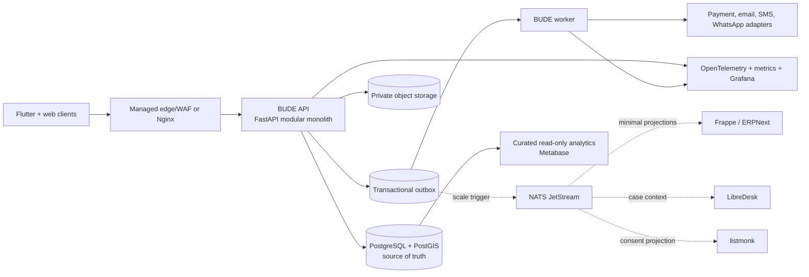

# BUDE HOME CBE — Zerodha-Inspired FOSS Architecture

- **Status:** Architecture decision and brainstorming proposal
- **Version:** 1.0
- **Prepared:** 2026-09-09
- **Decision point:** Before production Phase 1
- **Related:** [Production Plan](PRODUCTION_IMPLEMENTATION_PLAN.md), [Investor Plan](INVESTOR_BUSINESS_PLAN.md)

> “Zerodha-inspired” means applying Zerodha's published engineering principles and evaluating public open-source projects. It does not mean Zerodha's private trading platform is available, that its security automatically transfers to BUDE HOME, or that every tool on its stack page should be installed.

---

## 1. Recommendation

Yes, BUDE HOME should try this approach—but as a **small custom core with replaceable FOSS satellites**, not 20 microservices on day one.

- **FastAPI modular monolith:** customer-facing PG domain and API.
- **PostgreSQL + PostGIS:** sole source of truth for organizations, beds, stays, invoices, deposits, payments, authorization, and live listings.
- **Flutter:** owner, staff, and tenant mobile experiences.
- **Frappe/ERPNext:** internal CRM, owner onboarding, approvals, procurement, vendor workflows, and company accounting—not the product core.
- **LibreDesk:** support; **listmonk:** consented campaigns; **Metabase:** internal BI, each adopted only after an isolated proof and security/license review.
- **Transactional PostgreSQL outbox first; NATS JetStream later** when several independent consumers justify a bus.
- **Managed critical infrastructure first; selective self-hosting later** after cost, security, staffing, HA, and restore gates pass.

This captures Zerodha's advantages—frugality, FOSS, modularity, ownership, and small-team leverage—without importing brokerage-scale complexity.

---

## 2. What to copy from Zerodha

Zerodha's current [FOSS stack](https://zerodha.tech/stack/) includes Go, Python, JavaScript, Dart, PostgreSQL, ClickHouse, Redis, NATS, Kafka, Nginx, HAProxy, Grafana, VictoriaMetrics, Frappe, Flutter, ERPNext, Metabase, and many more. The important lesson is the selection method:

1. **Right tool per workload:** Go for critical throughput, Python for suitable business/data work, ERPNext/Frappe for internal processes, Flutter for mobile.
2. **Simple, understandable systems:** avoid both microservice sprawl and an unstructured giant monolith.
3. **FOSS-first and portable:** retain control, but explicitly own patching, backups, monitoring, access, and recovery.
4. **One authority per fact:** publish standardized events instead of allowing systems to reach into each other's databases.
5. **PostgreSQL goes far:** do not shard or add specialized databases before measured data/query pressure requires it.
6. **Extract measured hotspots:** Go, Valkey, ClickHouse, NATS, and Kafka solve observed problems; they are not starting decorations.
7. **Reuse generic business tools:** CRM, helpdesk, marketing, BI, and internal approvals are poor places to spend differentiating product effort.

Sources: [Zerodha stack and principles](https://zerodha.tech/blog/hello-world/), [future-ready architecture](https://zerodha.tech/blog/being-future-ready-with-common-sense/), and [PostgreSQL experience](https://zerodha.tech/blog/working-with-postgresql/).

---

## 3. Target architecture

### Non-negotiable boundaries

- Satellites never write core tables and never receive unrestricted database credentials.
- Core customer workflows do not synchronously depend on ERPNext, LibreDesk, listmonk, or Metabase.
- Events contain stable IDs and minimum metadata—not KYC images, government IDs, payment credentials, secrets, or full support transcripts.
- Every event has `event_id`, version, organization ID, aggregate ID, occurrence time, trace ID, and idempotent consumer handling.
- Every satellite owns a separate database/schema, credentials, backup, restore procedure, retention rule, and operational owner.
- A satellite outage must not block check-in, allocation, invoicing, rent recording, payment reconciliation, or tenant access.
- Removing a satellite must be possible because authoritative state remains in the core.

---

## 4. What BUDE HOME must build

| Capability | Decision | Why |
|---|---|---|
| Organization/property/building/room/bed model | **Build** | Defines tenancy and authorization scope |
| Availability, reservation, moves, notice, and stay lifecycle | **Build** | Requires PG-specific invariants and atomic transactions |
| Charges, invoices, deposits, ledgers, credits, refunds, allocations, reconciliation | **Build** | Financial integrity cannot be delegated to generic CRUD |
| Owner subscription entitlements and property publication | **Build** | Connects the business model to system permissions and listing eligibility |
| Owner, staff, tenant, and public APIs | **Build** | Core product/security boundary |
| Organization membership, property assignment, scoped authorization | **Build** | Generic global roles are unsafe |
| Verified live inventory and marketplace ranking | **Build** | Strategic supply-quality advantage |
| Complaint record and customer-visible state | **Build core** | A helpdesk may assist agents but cannot become the customer authority |
| Payment-provider integration | **Build adapter** | Provider SDKs carry requests; BUDE HOME owns state, signature checks, idempotency, and reconciliation |
| Consent, preferences, templates, and send audit | **Build** | Campaign tools consume consent; they do not define it |

---

## 5. Reusable open-source list

### Adopt now or prove during the pilot

| Component | Job | License/model | Recommendation and guardrail |
|---|---|---|---|
| [PostgreSQL](https://www.postgresql.org/) + PostGIS | Transactions and geospatial search | Liberal PostgreSQL license; PostGIS GPL | **Adopt now, managed first.** Constraints, PITR, restore tests, and separate roles |
| [FastAPI](https://fastapi.tiangolo.com/) | Core HTTP API | MIT | **Adopt if team spike wins.** Keep domain logic framework-light |
| [Flutter](https://flutter.dev/) | Android/iOS | BSD-style | **Adopt.** One role-aware app; Android pilot first |
| [Supabase managed](https://supabase.com/) | Managed PostgreSQL/Auth/Storage accelerator | FOSS components plus service terms | **Use selectively.** Core owns authorization; service keys stay server-side; stored objects need separate recovery |
| [Frappe](https://frappeframework.com/) / [ERPNext](https://erpnext.com/) | Internal CRM, approvals, vendors, procurement, accounts | Frappe MIT; ERPNext GPLv3 | **Internal pilot.** Separate DB/hostname; minimal API/event projection; no KYC or core financial writes |
| [LibreDesk](https://github.com/abhinavxd/libredesk) | Support inbox, knowledge base, SLAs | AGPLv3 | **Isolated proof.** Mirror case context only; evaluate young-project maturity, SSO, audit, export, and restore |
| [listmonk](https://github.com/knadh/listmonk) | Opt-in newsletters and owner education | AGPLv3 | **Campaigns only.** Transactional rent/payment/security messages remain in BUDE; core owns consent/suppression |
| [Metabase](https://www.metabase.com/) | Internal BI | OSS AGPL; commercial rules for some embedding | **Internal only.** Read replica/curated views, masked fields, read-only role; no customer embedding initially |
| OpenTelemetry + Prometheus-compatible metrics + Alertmanager | Traces, metrics, SLOs, alerts | Project-specific FOSS licenses | **Baseline.** Instrument API, worker, DB pool, outbox, providers, reconciliation, and security events |
| [Grafana OSS](https://grafana.com/) | Internal dashboards | AGPLv3 | **Internal use.** Do not public-embed; document modifications/license obligations |
| Nginx or managed edge | TLS, routing, limits, headers | FOSS or service terms | **Choose one edge.** Do not stack Nginx, HAProxy, and Kong without evidence |
| ClamAV | Uploaded-document malware scan | GPLv2 | **Adopt.** Quarantine → validate → scan → promote; failures go to review |

### Adopt only when the trigger is measurable

| Component | Use | Trigger | Caution |
|---|---|---|---|
| [NATS JetStream](https://docs.nats.io/nats-concepts/jetstream) | Durable event distribution/work queues | At least 3 independent consumers, sustained outbox lag, or required release isolation | Persistence, replicas, limits, credentials, and recovery need owners; still design for duplicates |
| [Valkey](https://valkey.io/) | Cache and distributed rate limits | Query/load measurement proves value | Never truth for bookings, money, entitlements, or authorization |
| [dungbeetle](https://github.com/zerodha/dungbeetle) | Async heavy read-only SQL/report jobs | Reports load OLTP or regularly time out | MIT, but use a read-only DB role, time/resource/query controls, and security review |
| [ClickHouse](https://clickhouse.com/) | High-volume immutable analytics/logs | PostgreSQL or managed logging is measurably expensive/slow | A second database adds retention, backup, security, and schema expertise |
| [Vector](https://vector.dev/) + [logchef](https://github.com/mr-karan/logchef) | Log pipeline and ClickHouse UI | ClickHouse logging ADR passes | Redact before shipping; monitor Vector advisories; Logchef is AGPL and relatively young |
| [VictoriaMetrics](https://victoriametrics.com/) | Long-retention metrics | Prometheus-compatible storage cost/scale requires it | Adds a stateful operational service |
| [whatomate](https://github.com/shridarpatil/whatomate) | WhatsApp integration | Proof supports current Meta APIs, templates, retries, consent, and SLA | AGPL, emerging, provider-policy dependent; retain a provider adapter and exit path |
| [otpgateway](https://github.com/knadh/otpgateway) | Pluggable OTP/address/bank verification | Threat model and security proof pass | MIT is not a security warranty; do not replace primary identity casually |
| [oore.build](https://github.com/oore-ci/oore.build) | Flutter CI/internal distribution | Mobile team needs it and maturity is acceptable | Young project; protect signing keys, runners, artifacts, and provenance |
| [pfxsigner](https://github.com/knadh/pfxsigner) | PDF signing | Indian legal review and strong key custody are proven | AGPL; PDF signing is not automatically compliant e-signing |
| [Wazuh](https://wazuh.com/) | SIEM/host monitoring | Dedicated security/SRE owner exists | Tuning/alert fatigue; not a substitute for secure design |
| [NetBird](https://netbird.io/) | Private operator access | Self-hosted tools need zero-trust staff access | Own MFA, device lifecycle, logs, recovery access, and upgrades |
| [flowctl](https://github.com/cvhariharan/flowctl) | Controlled internal workflows | Repeated runbooks need self-service execution | Young project; never expose unrestricted shell/DB actions |

### Defer or reject in year one

| Candidate | Decision | Reason |
|---|---|---|
| Kafka | **Defer** | PostgreSQL outbox or NATS is smaller and adequate for expected scale |
| Kubernetes | **Defer** | Adds a platform before a platform team or workload count justifies it |
| Nomad/Consul | **Defer** | Revisit only with strong Linux/HA skills and a documented TCO benefit |
| ScyllaDB/distributed NoSQL | **Reject initially** | Financial and booking invariants fit PostgreSQL; no scale evidence |
| Full self-hosted Supabase production | **Defer** | Official docs place hardening, HA, backups, PITR, monitoring, and upgrades on the operator and identify managed features absent from self-hosting |
| Self-hosted outbound mail | **Reject initially** | Deliverability, reputation, abuse, and security are specialized |
| Nginx + HAProxy + Kong together | **Reject** | One edge/gateway layer is sufficient initially |
| Customer-facing Metabase | **Defer** | Product authorization/tenant isolation and embedding license require deliberate design |
| Generic OSS booking/PMS as the core | **Reject** | Hotel/apartment semantics do not safely model PG beds, monthly stays, recurring charges, and deposits |
| Duplicate helpdesks, CRMs, BI tools, or buses | **Reject** | Duplicate truth and upkeep erase reuse benefits |

---

## 6. Frappe integration boundary

### Good Frappe/ERPNext uses

- Sales lead and PG-owner pipeline.
- Customer onboarding checklist and field visit.
- Vendor master, purchase, expense, and approval workflows.
- Internal escalation and non-product operational cases.
- Company accounting and controlled journal/export intake, reviewed by accountants.
- Staff, leave, internal assets, and administration if required.

### Prohibited Frappe authorities

- Login/session or organization/property authorization.
- Live availability, reservations, allocation, moves, and stays.
- Tenant KYC documents.
- Issued tenant invoices, deposits, payment allocation, refunds, and reconciliation.
- Subscription entitlements and public listing eligibility.

Integration uses versioned BUDE APIs and event projections. Frappe gets an internal customer ID and minimum business context. It receives no direct core database access.

---

## 7. Source-of-truth table

| Data | Authority | Permitted projection |
|---|---|---|
| Identity-provider subject | Managed identity service | Immutable BUDE user ID where required |
| Membership and property scope | BUDE core | Non-authoritative support/CRM label only |
| Property, bed, availability, reservation, stay | BUDE core | Public listing, minimal CRM context, aggregate analytics |
| Invoice, deposit, payment, allocation, refund | BUDE core | Redacted support status, accounting export, aggregate analytics |
| KYC/private documents | BUDE core/private storage | No replication; time-limited audited access through core only |
| Consent and notification preferences | BUDE core | listmonk/provider subscription and suppression projection |
| Lead/sales pipeline | Frappe/ERPNext | Customer/account ID and conversion result to core |
| Agent conversations | LibreDesk | Case status and selected notes to complaint record |
| Campaign content/stats | listmonk | Aggregate results; consent remains in core |
| Curated telemetry/BI | Analytics layer | Aggregated/de-identified output only |

---

## 8. Adoption scorecard

Score 0–3 per criterion. Require at least 24/30, no zero in security or recovery, primary/backup owners, and a rollback path.

| Criterion | Question |
|---|---|
| Problem fit | Does it remove validated work rather than add novelty? |
| Security | Does it have a policy, supported releases, RBAC, secure defaults, and timely fixes? |
| Maintenance | Are releases and maintainers active? |
| License | Is exact-version use/modification/embedding legally approved? |
| Data isolation | Can access and retained PII be minimized? |
| Integration | Are APIs/webhooks versionable and idempotent without shared DB writes? |
| Recovery | Can backup and clean-environment restore be proven? |
| Observability | Are health, audit, metrics, and alerts adequate? |
| Exitability | Can it be removed or rebuilt from core projections? |
| Ownership | Are two people trained with a runbook and patch SLA? |

### Mandatory proof evidence

- Immutable version/image digest, source repository, and SPDX license.
- SBOM plus source, dependency, container, IaC, and secret scans.
- Auth, MFA/SSO, RBAC, service account, and network exposure design.
- Data/PII inventory, encryption, retention, deletion, export, and audit.
- Successful backup, clean restore, upgrade, rollback, outage, and disk-pressure tests.
- Resource/load baseline and operational-hours estimate.
- Removal test proving core customer workflows continue.

---

## 9. Twelve-week task and micro-task plan

### T1 — Principles and metrics (Week 1; architecture/product/security; 3 days)

- [ ] Name architecture, business, security, and operational owners.
- [ ] Approve one-core/replaceable-satellites and no-shared-database rules.
- [ ] Inventory team skills: Python, Go, PostgreSQL, Flutter, Frappe, Linux/SRE.
- [ ] Forecast 12-month organizations, beds, payments, events, messages, tickets, storage, and traffic.
- [ ] Set SLO, RPO/RTO, privacy, security, and monthly cost targets.
- [ ] Cap pilot production deployables at six; document exceptions.
- [ ] Record baseline managed-service cost and estimated operator hours.
- [ ] Publish ADR-001 build-versus-adopt policy.

Gate: measurable criteria are approved; “Zerodha uses it” is not an acceptance criterion.

### T2 — FastAPI versus Go spike (Weeks 1–2; backend/database; 8 days)

- [ ] Implement the same organization/property/room/bed slice in each.
- [ ] Enforce membership and property scope.
- [ ] Reserve one bed atomically under concurrent requests.
- [ ] Issue an immutable invoice and record a duplicate-safe payment.
- [ ] Write an outbox event in the business transaction.
- [ ] Add OpenAPI, structured logs, trace, metrics, readiness, and shutdown.
- [ ] Run race, concurrency, failure, latency, memory, and profiling tests.
- [ ] Compare delivery/review time, hiring, testing, security, and ops familiarity.
- [ ] Publish ADR-002 choosing one primary backend language.

Gate: both pass the same correctness tests. Default on a meaningful tie: FastAPI for iteration speed; use Go later for measured hotspots.

### T3 — Core data and event boundary (Weeks 2–3; backend/database/security; 7 days)

- [ ] Define table and API ownership; prohibit satellite writes.
- [ ] Implement organization keys, memberships, assignments, audit, idempotency, and outbox.
- [ ] Separate migration, application, analytics-read, and backup roles.
- [ ] Add RLS defense-in-depth and cross-organization denial tests.
- [ ] Classify PII/KYC and prohibit sensitive event fields.
- [ ] Define API/event versioning and consumer idempotency tests.
- [ ] Create synthetic/redacted fixtures; prohibit production data in development.

Gate: tests prove tenant isolation, atomic reservation, immutable invoices, and duplicate-safe events.

### T4 — Managed-first portable foundation (Weeks 2–4; platform; 8 days)

- [ ] Provision development/staging with infrastructure as code.
- [ ] Configure managed PostgreSQL/PostGIS, PITR, pools, and limits.
- [ ] Configure identity while keeping authorization in core.
- [ ] Separate media, quarantine, KYC, agreement, and export storage.
- [ ] Add unique keys, file limits/types, malware scanning, short-lived access, and audit.
- [ ] Export/restore database to an independent PostgreSQL environment.
- [ ] Export/restore storage independently and measure RPO/RTO.
- [ ] Record every vendor-specific feature and portable alternative.

Gate: clean-environment recovery succeeds without undocumented dashboard actions.

### T5 — Frappe/ERPNext internal pilot (Weeks 3–5; operations/integration; 8 days)

- [ ] Select lead, onboarding, vendor, expense, and approval workflows only.
- [ ] Deploy on separate hostname/network/database with staff MFA/SSO policy.
- [ ] Map only internal customer IDs; exclude KYC and raw payment details.
- [ ] Build core-to-Frappe adapter from outbox events.
- [ ] Permit Frappe-to-core commands only through scoped APIs where validated.
- [ ] Add retries, dead letter, reconciliation, and audit.
- [ ] Complete BUDE check-in/payment flows during a Frappe outage.
- [ ] Document MIT/GPL obligations and custom apps.
- [ ] Measure staff time saved for four weeks.

Gate: one internal burden is measurably reduced and Frappe failure cannot break customers.

### T6 — Support and campaigns proofs (Weeks 4–6; support/growth/security; 8 days)

- [ ] Score LibreDesk against one managed fallback.
- [ ] Configure roles, SSO/OIDC, audit, SLA, attachment limits, export, and deletion.
- [ ] Link complaint ID with minimal tenant context.
- [ ] Test backup, restore, upgrade, rollback, outage, and complete removal.
- [ ] Define transactional, operational, and marketing message classes.
- [ ] Deploy listmonk on a dedicated sending subdomain.
- [ ] Sync consent and suppression bidirectionally using stable subscriber IDs.
- [ ] Add bounce, complaint, rate, send-limit, and lawful-import controls.
- [ ] Document both AGPL decisions and modification/source policy.

Gate: core remains authoritative for complaints, consent, and transactional sends.

### T7 — Safe internal analytics (Weeks 6–8; data/security; 7 days)

- [ ] Define 15 business/investor metrics with formulas and owners.
- [ ] Create masked curated views or replicated analytics schema.
- [ ] Configure a read-only user with statement timeout and no KYC access.
- [ ] Deploy internal Metabase behind staff authentication/private access.
- [ ] Configure role-based collections and query/load limits.
- [ ] Reconcile dashboards to approved SQL definitions.
- [ ] Review AGPL/embedding; prohibit customer embedding in this phase.
- [ ] Back up and restore dashboard/configuration state.

Gate: analytics cannot expose cross-tenant detail or exhaust OLTP.

### T8 — Outbox versus NATS decision (Weeks 7–8; backend/platform; 6 days)

- [ ] Measure consumer count, volume, retries, outbox lag, and effort.
- [ ] Build NATS proof only if a documented trigger is met.
- [ ] Configure TLS, accounts, subjects, durable consumers, replicas, retention, and limits.
- [ ] Publish from outbox using stable message IDs.
- [ ] Test duplicates, reordering, delay, poison messages, replay, node loss, and disk pressure.
- [ ] Compare operational cost with keeping the database worker.
- [ ] Publish ADR-003 retain-outbox or outbox-to-NATS.

Gate: NATS improves a measured boundary and recovery is proven; idempotency remains mandatory.

### T9 — FOSS supply-chain governance (Weeks 8–9; security/legal; 6 days)

- [ ] Create component/version/owner/source/SPDX inventory and third-party notices.
- [ ] Generate SBOMs and pin production images by digest—never `latest`.
- [ ] Scan code, dependencies, images, IaC, and secrets in CI.
- [ ] Set critical/high vulnerability remediation SLAs and exception approval.
- [ ] Subscribe owners to releases and advisories.
- [ ] Get legal review for AGPL/GPL modification, network use, distribution, and embedding.
- [ ] Define fork policy, divergence budget, upstream plan, and exit trigger.
- [ ] Review trademarks and avoid implying Zerodha endorsement.

Gate: unknown-license, unowned, or critically vulnerable components cannot deploy.

### T10 — Observability and recovery (Weeks 9–11; SRE/security; 9 days)

- [ ] Instrument API/worker with OpenTelemetry, RED, and USE metrics.
- [ ] Add business-correctness metrics: conflicts, unallocated money, reconciliation lag, message failures, cross-tenant denials.
- [ ] Deploy one metrics store, Grafana, and Alertmanager or managed equivalents.
- [ ] Redact tokens, IDs, document URLs, and request bodies before logging.
- [ ] Add dependency health and external synthetic checks.
- [ ] Define SLOs, alert thresholds, escalation, and runbooks.
- [ ] Run provider outage, DB failover, restore, credential rotation, and disk-pressure games.
- [ ] Measure maintenance hours per service.

Gate: an operator can detect, contain, diagnose, recover, and document the top five failures.

### T11 — Self-hosting TCO decision (Week 11; platform/finance/security; 4 days)

- [ ] Calculate 12-month managed charges and usage sensitivity.
- [ ] Calculate compute, storage, traffic, backups, monitoring, licenses, and engineer/on-call time.
- [ ] Price downtime and recovery risk rather than comparing VM and SaaS prices alone.
- [ ] Require two trained owners, HA proof, restore proof, patch SLA, migration, and rollback.
- [ ] Keep database, identity, object storage, secrets, edge, and communications managed unless all gates pass.

Gate: each self-host decision has a positive risk-adjusted TCO and proven operations.

### T12 — Go/no-go and architecture freeze (Week 12; leadership; 3 days)

- [ ] Review scores and evidence; remove failed experiments completely.
- [ ] Count deployables, stores, databases, secrets, backups, dashboards, and owners.
- [ ] Approve the initial software bill of materials and version policy.
- [ ] Freeze ADRs for backend, platform, Frappe, support, campaigns, analytics, and messaging.
- [ ] Update stack-specific tasks in the Production Implementation Plan.
- [ ] Schedule quarterly build/adopt/remove reviews.

Gate: every production service has a reason, two owners, security model, recovery proof, upgrade path, license decision, monitoring, and removal path.

---

## 10. Self-hosting rule

FOSS and self-hosting are different decisions. Self-host only when all are true:

- Managed premium exceeds infrastructure plus realistic engineering/on-call time.
- Two people can secure, patch, monitor, restore, and upgrade it.
- HA and disaster recovery are tested.
- Vulnerability and incident SLAs can be met.
- Data control or customization creates measurable value.
- Migration and rollback work in staging.

Prefer managed when the system affects payments, availability, tenant access, or legal evidence and the team lacks deep database/SRE coverage. Supabase's official documentation explicitly says self-hosters own provisioning, hardening, database maintenance, HA, backups, disaster recovery, monitoring, and uptime, while several managed capabilities are absent.

---

## 11. License and security rules

Open source does not mean “no obligations” or “secure by default.”

- Frappe is MIT; ERPNext is GPLv3.
- listmonk, LibreDesk, logchef, Grafana OSS, and Metabase OSS use AGPL terms at this review.
- dungbeetle and otpgateway are MIT; NATS is Apache 2.0; PostgreSQL has its liberal license; ClickHouse is Apache 2.0; Valkey uses BSD terms; Vector uses MPL 2.0.
- Decide from the exact repository, version, plugins, modifications, and embedding model.
- A separate container does not magically remove AGPL duties. Obtain counsel, preserve notices, track changes, and provide source where required.
- Stars or Zerodha usage are not security warranties. Pin, scan, harden, restrict, monitor, restore, upgrade, and roll back.
- Keep KYC and payment data out of satellites even when they are self-hosted.

This is an engineering control, not legal advice.

---

## 12. Cost and complexity guardrails

- Maximum six pilot deployables directly owned by the product team.
- One core transactional database, one message mechanism, one CRM, one helpdesk, one campaign tool, and one BI tool.
- One primary custom-backend language.
- No customer feature synchronously depends on an internal tool.
- Budget 10–15% of engineering capacity for security, upgrades, observation, backups, and recovery.
- Review monthly: version, advisories, restore date, availability, resource growth, incidents, operator hours, license change, business value, and retain/replace/remove decision.

A free service that consumes senior engineering time without measurable product or operating value should be removed.

---

## 13. Final decision summary

1. Keep PostgreSQL central.
2. Build the unique PG transactional domain once.
3. Start with FastAPI unless the measured Go spike and team capability clearly win.
4. Use Frappe/ERPNext strongly for internal workflows but outside the customer trust boundary.
5. Prove listmonk, LibreDesk, and Metabase as isolated satellites.
6. Start with an outbox; add NATS only for proven consumers.
7. Keep Flutter.
8. Keep critical infrastructure managed until self-hosting passes TCO, security, HA, and recovery gates.
9. Extract small Go services only for measured hotspots.
10. Prefer a smaller, understood, removable stack over a large collection of “free” services.

---

## 14. Primary references

- [Zerodha FOSS stack](https://zerodha.tech/stack/)
- [Zerodha FOSS projects](https://zerodha.tech/projects/)
- [Zerodha stack and principles](https://zerodha.tech/blog/hello-world/)
- [Scaling with common sense](https://zerodha.tech/blog/scaling-with-common-sense/)
- [Being future ready with common sense](https://zerodha.tech/blog/being-future-ready-with-common-sense/)
- [Working with PostgreSQL](https://zerodha.tech/blog/working-with-postgresql/)
- [Logging with Vector, ClickHouse, and Metabase](https://zerodha.tech/blog/logging-at-zerodha/)
- [High-volume PDF worker architecture](https://zerodha.tech/blog/1-5-million-pdfs-in-25-minutes/)
- [Zerodha GitHub organization](https://github.com/zerodha)
- [Frappe REST APIs](https://docs.frappe.io/framework/user/en/guides/integration/rest_api)
- [Supabase self-hosting responsibilities](https://supabase.com/docs/guides/self-hosting)
- [Supabase shared-responsibility model](https://supabase.com/docs/guides/deployment/shared-responsibility-model)
- [NATS JetStream](https://docs.nats.io/nats-concepts/jetstream)
- [Metabase licensing](https://www.metabase.com/license)
- [Grafana licensing](https://grafana.com/licensing/)
- [PostgreSQL license](https://www.postgresql.org/about/licence/)

Recheck versions, licenses, security status, and operational claims at adoption time.
